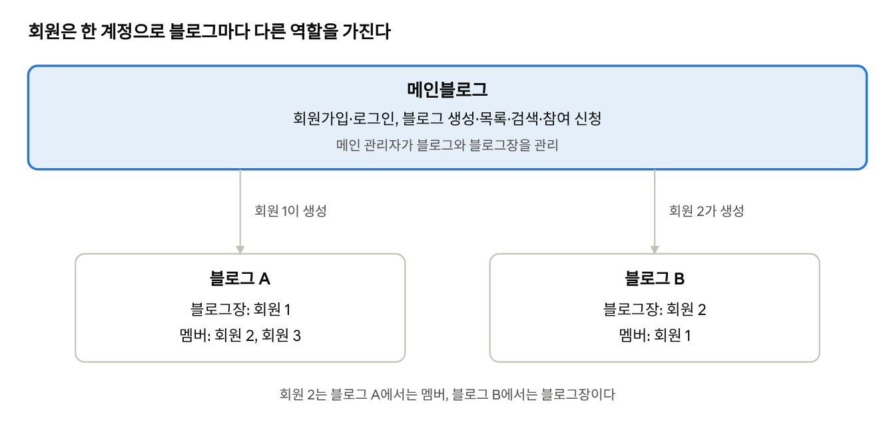
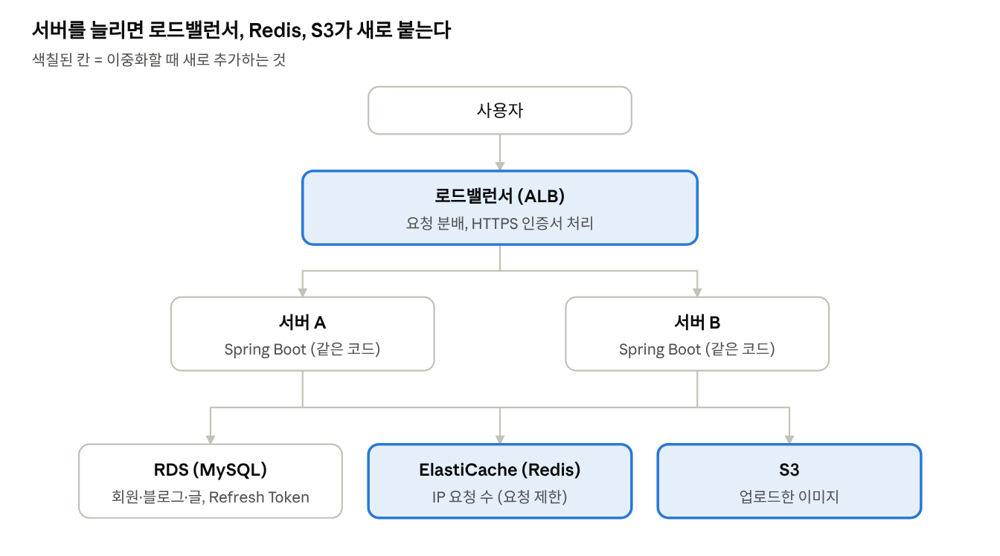

# 메인블로그 요구사항 분석서

**기본 요구사항 (1\~5장, 7장)**

2026-10-02

**목차** (제목을 누르면 그 위치로 이동합니다)

- [1. 개요](#1-개요)
- [2. 사용자 유형과 권한](#2-사용자-유형과-권한)
  - [역할별로 할 수 있는 일](#역할별로-할-수-있는-일)
- [3. 기능 요구사항](#3-기능-요구사항)
  - [3.1 회원관리 (보안 중심)](#31-회원관리-보안-중심)
  - [3.2 블로그 관리 (생성·참여)](#32-블로그-관리-생성참여)
  - [3.3 소셜](#33-소셜)
  - [3.4 게시판](#34-게시판)
  - [3.5 메인 관리자](#35-메인-관리자)
  - [3.6 알림](#36-알림)
  - [3.7 제재 권한 (메인 관리자·블로그장)](#37-제재-권한-메인-관리자블로그장)
- [4. 비기능 요구사항](#4-비기능-요구사항)
  - [4.1 보안](#41-보안)
  - [4.2 성능·사용성](#42-성능사용성)
  - [4.3 확장성 (서버 이중화 대비)](#43-확장성-서버-이중화-대비)
  - [4.4 개인정보 가려서 보여주기 (마스킹)](#44-개인정보-가려서-보여주기-마스킹)
  - [4.5 데이터 보관·삭제](#45-데이터-보관삭제)
  - [4.6 개인정보 처리](#46-개인정보-처리)
  - [4.7 운영 (백업·오류·로그·개발 규칙)](#47-운영-백업오류로그개발-규칙)
- [5. 메인과 개별 블로그의 범위, 결정 필요 사항](#5-메인과-개별-블로그의-범위-결정-필요-사항)
- [7. 구현 방식](#7-구현-방식)

## 1. 개요

메인블로그는 회원가입, 로그인, 블로그 생성·참여를 담당하는 **플랫폼**입니다. 실제 글쓰기 공간은 회원이 만든 **개별 블로그**입니다. 이 문서는 메인블로그의 요구사항만 다룹니다. 개별 블로그 안의 기능은 별도 문서에서 확장합니다.

- **메인블로그**: 회원 계정, 블로그 생성과 참여, 소셜, 전체 관리
- **개별 블로그**: 회원이 만든 블로그. 만든 사람이 블로그장이 되고, 다른 회원이 참여할 수 있음
- **관리 구조**: 메인 관리자는 블로그와 블로그장을, 블로그장은 자기 블로그의 멤버를 관리

*서비스 구조 · 메인블로그와 개별 블로그 2개*

블로그장과 멤버는 계정 종류가 아니라 블로그별 역할이라서, 같은 회원이 블로그마다 다른 권한을 갖습니다.

| 구분 | 내용 |
| --- | --- |
| 목적 | 회원이 블로그를 만들고 함께 운영하는 블로그 플랫폼의 메인 기능 정의 |
| 범위 | 회원관리, 블로그 관리, 소셜, 공통 게시판, 메인 관리자, 비기능(보안) |
| 범위 밖 | 개별 블로그 내부 기능(블로그 꾸미기, 블로그별 카테고리, 블로그 멤버 등급 세부) |

## 2. 사용자 유형과 권한

사용자는 5가지입니다. 블로그장과 블로그 멤버는 따로 가입하는 계정이 아닙니다. **회원이 블로그별로 갖는 역할**입니다. 그래서 한 회원이 A 블로그에서는 블로그장이고 B 블로그에서는 멤버일 수 있습니다.

| 사용자 | 설명 |
| --- | --- |
| 비회원 | 로그인하지 않은 방문자 |
| 회원 | 메인블로그에 가입하고 로그인한 사용자 |
| 블로그 멤버 | 다른 사람의 블로그에 참여한 회원 |
| 블로그장 | 블로그를 만든 회원. 그 블로그의 운영 권한을 가짐 |
| 메인 관리자 | 블로그와 블로그장을 관리하는 운영자(회원은 검색·조회하고, 메인 프로필 신고가 오면 계정 경고·프로필 초기화·계정 정지만 함). 블로그 활동(블로그 만들기·참여·글쓰기·댓글·좋아요·팔로우)은 하지 않음 |

기능별 권한 (O = 가능, X = 불가, 본인 = 자기 것만)

| 기능 | 비회원 | 회원 | 블로그 멤버 | 블로그장 | 메인 관리자 |
| --- | --- | --- | --- | --- | --- |
| 블로그 목록·검색 | O | O | O | O | O |
| 공개 글 읽기 | O | O | O | O | O |
| 회원가입 | O | X | X | X | X |
| 블로그 생성 | X | O | O | O | X |
| 블로그 참여 신청 | X | O | 이미 참여 | 이미 소유 | X |
| 블로그에 글 쓰기 | X | X | O | O | 메인 공지만 (BRD-10) |
| 글 수정 | X | X | 본인 글 | 본인 글 | X |
| 글 삭제 | X | X | 본인 글 | 본인 글 + 자기 블로그 글 | O |
| 참여 승인·멤버 강퇴 | X | X | X | 본인 블로그 | X |
| 블로그 폐쇄 | X | X | X | 본인 블로그 | O |
| 팔로우·댓글·좋아요 | X | O | O | O | X |
| 멤버 경고·정지·강제 퇴장 | X | X | X | 본인 블로그 | X |
| 블로그장 강퇴(권한 박탈) | X | X | X | X | O |
| 이메일·비밀번호 찾기 | O | X | X | X | X |

### 역할별로 할 수 있는 일

블로그장은 회원이 할 수 있는 일을 모두 하고, 자기 블로그에서만 아래 블로그장 표의 일을 더 합니다. 부블로그장은 블로그장 표 중 블로그장이 허용한 항목만 할 수 있습니다.

**회원** (로그인한 모든 회원, 블로그 멤버 포함)

| 영역 | 할 수 있는 일 | 조건 |
| --- | --- | --- |
| 계정 | 회원정보 수정(닉네임·프로필 사진·전화번호·비밀번호, 이름은 불가), 비밀번호 재설정, 회원탈퇴 | 블로그장이면 운영 중인 블로그를 모두 위임하거나 폐쇄가 끝난 뒤에 탈퇴 가능 (폐쇄 예정 7일 동안은 탈퇴 불가) |
| 블로그 만들기 | 블로그 생성 | 공개(일부 공개 포함) 3개, 비공개 5개까지 |
| 블로그 참여 | 블로그 목록·검색, 참여 신청·신청 취소, 블로그 탈퇴, 블로그 구독, 내 블로그 목록, 블로그장 위임 요청 수락·거절 | 승인제 블로그는 블로그장 승인 필요. 거절되면 7일 뒤 재신청 |
| 글 | 글 쓰기 | 참여한 블로그에서만 (멤버) |
| 글 | 글 수정·삭제 | 본인 글만 |
| 댓글·좋아요 | 댓글·대댓글 쓰기, 본인 댓글 수정·삭제, 좋아요 | 공개 글, 또는 참여한 블로그의 글 |
| 소셜 | 회원 팔로우, 프로필 보기·수정, 차단 |  |
| 알림 | 알림 받기, 받을 알림 종류 설정, 읽음·일괄 삭제 | 관리자나 블로그장이 내 글을 삭제하면 알림을 받음 |
| 신고 | 회원·블로그·글·댓글 신고 | 같은 대상은 2주에 한 번 |
| 검색·공유 | 통합 검색, 최근 검색어 관리, 글 링크 공유 |  |

**블로그장** (자기 블로그에서만, 회원의 일에 더해서)

| 영역 | 할 수 있는 일 | 부블로그장에게 맡길 수 있음 |
| --- | --- | --- |
| 블로그 운영 | 블로그 정보 수정(이름·소개·대표 이미지), 공개 범위(공개·일부 공개·비공개)·참여 방식(자유/승인제) 변경 | 정보 수정만 가능 |
| 멤버 관리 | 참여 신청 승인·거절, 멤버 경고·정지·강제 퇴장(강제 퇴장 시 블랙리스트 등록), 블로그 안 신고 처리, 블랙리스트 해제 문의 처리, 멤버별 신고 누적 확인(정지 3번이면 강제 퇴장 처리), 멤버 정보 보기(이메일·이름·닉네임·전화번호, 이메일과 전화번호는 가려서 표시) | 가능 |
| 부블로그장 | 부블로그장 지정·해제, 부블로그장의 권한 범위 설정 | 불가 (블로그장만) |
| 글 관리 | 다른 멤버의 글 삭제(수정은 불가), 카테고리 관리, 블로그 공지 작성 | 가능 |
| 알림 | 참여 신청 알림 받기, 블로그 알림 보관 설정(7일 또는 일괄 삭제) |  |
| 위임·폐쇄 | 블로그장 위임 요청(받는 멤버가 수락해야 넘어감. 위임할 멤버가 없으면 폐쇄만 가능. 폐쇄 예정 중에는 철회한 뒤에 가능), 블로그 폐쇄(누른 날짜 기준 7일 뒤 새벽 4시, 멤버·구독자에게 즉시·3일 전·1일 전 알림), 폐쇄 철회(폐쇄 예정 7일 안에 취소. 관리자 강제 폐쇄도 철회 가능) | 불가 (블로그장만) |

블로그장도 할 수 없는 일: 다른 블로그 관리(SEC-07), 다른 멤버의 글 수정.

## 3. 기능 요구사항

요구사항 ID는 모듈-번호 형식입니다. USR(회원), BLG(블로그), SOC(소셜), BRD(게시판), ADM(관리자), SEC(보안)을 씁니다. 비고의 SEC 번호는 4장의 보안 요구사항을 가리킵니다.

### 3.1 회원관리 (보안 중심)

회원 계정은 메인블로그 한 곳에서만 만들고, 모든 개별 블로그가 이 계정을 공유합니다.

| ID | 요구사항명 | 설명 | 우선순위 | 비고 |
| --- | --- | --- | --- | --- |
| USR-01 | 회원가입 | 이메일을 아이디로 쓴다. ① 이메일 인증(USR-02) → ② 비밀번호 입력 → ③ 이름, 닉네임, 전화번호 입력 순서로 진행하고, 모두 끝나야 가입된다. 이메일과 닉네임은 중복할 수 없다. 전화번호는 숫자만 저장하고 1차에는 중복을 허용한다(문자 인증을 넣는 2차에 한 번호 한 계정). | 상 | SEC-01, SEC-02 |
| USR-02 | 이메일 인증 | 가입을 시작할 때 입력한 이메일로 6자리 인증번호를 보내고, 맞게 입력해야 다음 단계(비밀번호 입력)로 넘어간다. 이미 가입된 이메일이어도 화면에는 "인증번호를 보냈습니다"라고 똑같이 보여주고, 그 이메일로는 인증번호 대신 "이미 가입된 이메일입니다" 안내 메일을 보낸다. 인증번호는 Spring 서버가 직접 만들어 메일로 보내고, 10분 뒤 만료되며 5번 틀리면 무효가 된다. 다시 보내기는 1분에 한 번까지다. | 중 |  |
| USR-03 | 로그인 | 이메일과 비밀번호로 로그인한다. 로그인 상태는 모든 개별 블로그에서 유지된다. 로그인 화면에 "로그인 유지" 체크박스가 있다(SEC-04). | 상 | SEC-03, SEC-04 |
| USR-04 | 로그아웃 | 서버에서 Refresh Token을 폐기하고 토큰 쿠키를 지운 뒤 메인으로 이동한다. | 상 | SEC-04 |
| USR-05 | 회원탈퇴 | 비밀번호를 다시 확인한 뒤 탈퇴한다. 블로그장인 블로그가 있으면 바로 탈퇴할 수 없다. 탈퇴 화면에서 운영 중인 블로그 목록을 보여주고, 블로그마다 위임(BLG-08)하거나 폐쇄(BLG-09)가 끝난 뒤에 탈퇴할 수 있다. 폐쇄 버튼을 눌러 7일 유예 중인 블로그도 폐쇄가 끝날 때까지는 블로그장이므로 탈퇴할 수 없다. 탈퇴한 회원의 글은 "탈퇴한 회원"으로 표시되어 남는다. | 상 | BLG-09 |
| USR-06 | 비밀번호 찾기·재설정 | 로그인 화면의 "비밀번호 찾기"에서 가입한 이메일을 입력하면 6자리 인증번호를 메일로 보낸다. 인증번호는 30분 뒤 만료되고 한 번만 쓸 수 있으며 5번 틀리면 무효가 된다(6.7). 맞게 입력하면 같은 화면에서 새 비밀번호를 두 번 입력하면(6.7 비밀번호 규칙) 바뀐다. 바뀌면 다른 기기의 로그인은 모두 로그아웃되고 로그인 잠금도 풀린다. 화면에는 가입 여부와 관계없이 "입력한 이메일로 안내를 보냈습니다"라고 같은 문구를 보여준다. | 중 | SEC-05 |
| USR-07 | 회원정보 수정 | 닉네임, 프로필 사진, 전화번호, 비밀번호를 바꾼다. 수정은 본인만 할 수 있다. 비밀번호 변경 시 현재 비밀번호를 확인한다. 이메일(아이디)과 이름은 바꿀 수 없다. | 중 | SEC-02 |
| USR-08 | 이메일 찾기 | ① 이름과 전화번호를 입력한다(전화번호는 숫자만, 이름은 앞뒤 공백을 빼고 비교). ② 일치하는 계정의 이메일을 가려서 가입일과 함께 보여준다(예: ab\*\*\*@gmail.com, 2026.10.02 가입). 여러 개면 모두 보여주고, 없으면 "일치하는 회원 정보가 없습니다"를 보여준다. 탈퇴한 계정은 제외한다. ③ 계정 옆 [비밀번호 재설정]을 누르면 그 이메일로 6자리 인증번호를 보내고, ④ 맞게 입력하면 새 비밀번호를 설정한다(USR-06과 같은 절차). ③의 요청은 회원 번호가 아니라 ①에서 받은 임시 토큰(10분 유효)으로 한다. 같은 IP는 10분에 5번까지 찾을 수 있다. | 중 | 4.4 가림 표시, 7장 매크로 방지 |

**팀 결정: 6자리 코드를 Spring에서 직접 보내고 검증**합니다. 외부 인증 서비스 없이 서버가 코드를 만들고, `spring-boot-starter-mail`(JavaMailSender)로 보냅니다.

- **고른 이유**
  - 가입 화면을 벗어나지 않고 ① 이메일 인증 → ② 비밀번호 → ③ 이름·닉네임·전화번호 순서(USR-01)가 한 흐름으로 이어짐.
  - 외부 인증 서비스 없이 Spring 안에서 끝나서 비용과 키 관리가 없고, 만료·재발송·입력 횟수 규칙을 직접 정할 수 있음.
- **인증 링크를 쓰지 않은 이유**
  - 메일 앱 안의 브라우저에서 링크가 열리면 가입하던 화면과 흐름이 끊김.
  - 링크를 받을 페이지와 토큰 처리를 따로 만들어야 함.
- **외부 인증 서비스(Firebase Auth 등)를 쓰지 않은 이유**
  - 회원 정보가 우리 DB와 외부 서비스 두 곳에 나뉘고, 인증 규칙을 그 서비스에 맞춰야 함.

1. 코드 만들기: `SecureRandom`으로 6자리 숫자를 만듭니다.
2. 저장: 가입 전이라 회원 번호가 없으므로 이메일 기준으로 DB에 해시해 저장합니다. 만료는 10분(USR-02)입니다.
3. 검증: 5번 틀리면 그 코드는 무효가 됩니다.
4. 재발송: 1분에 한 번까지, 다시 보내면 이전 코드는 무효가 됩니다.
5. 인증 완료: 가입 마지막 단계에서 서버가 이 이메일의 인증 완료 여부를 다시 확인합니다. 화면에서 인증 단계를 건너뛰는 것을 막기 위해서입니다.

메일을 실제로 보낼 SMTP 서버는 Gmail SMTP를 씁니다(7장).

### 3.2 블로그 관리 (생성·참여)

이 플랫폼만의 핵심 모듈입니다. 회원은 메인에서 블로그를 만들거나 찾아서 참여하고, 들어간 뒤의 활동은 개별 블로그에서 합니다.

| ID | 요구사항명 | 설명 | 우선순위 | 비고 |
| --- | --- | --- | --- | --- |
| BLG-01 | 블로그 생성 | 블로그 이름, 주소(URL), 소개, 대표 이미지, 태그(최대 10개, 규칙은 6.4와 같음), 공개 범위(공개·일부 공개·비공개), 참여 방식을 정해 만든다. 만든 회원은 그 블로그의 블로그장이 된다. 공개를 비공개로 바꾸면 구독은 유지되지만 멤버가 아닌 구독자에게는 글이 보이지 않고, 구독자에게 알림이 간다. 공개는 목록·검색·피드에 보이고 누구나 볼 수 있다. 일부 공개는 목록·검색·피드에 나오지 않고, 공유 링크를 타고 들어온 사람만 볼 수 있으며 공유 버튼이 보인다. 공유 링크에는 블로그 주소와 별개인 무작위 값이 들어가 주소만 알아서는 들어갈 수 없고, 블로그장이 링크를 새로 만들면 이전 링크는 막힌다. 비공개는 멤버만 볼 수 있고 공유 링크와 공유 버튼이 없다. 일부 공개 블로그는 링크로 들어온 비회원도 볼 수 있다. 링크로 들어와도 자동으로 구독되지 않고, 로그인한 회원에게 "구독하기" 버튼이 보인다. 구독하면 내 구독 목록에서 링크 없이 다시 들어올 수 있다. | 상 | 주소 중복 불가 |
| BLG-02 | 블로그 목록 | 메인 화면에 전체 블로그를 최신순·인기순으로 보여준다. 인기순은 멤버 수가 많은 순서다(D-89). 페이징을 지원한다. | 상 | 비공개·일부 공개 블로그는 제외 |
| BLG-03 | 블로그 검색 | 블로그 이름, 소개, 태그로 검색한다. | 중 |  |
| BLG-04 | 블로그 참여 신청 | 회원이 블로그에 참여한다. 자유 참여 블로그는 바로 멤버가 되고, 승인제 블로그는 블로그장의 승인을 기다린다. 참여 방식(자유/승인제)은 블로그장이 정한다. | 상 | D-01 |
| BLG-05 | 참여 승인·거절 | 블로그장이 참여 신청을 승인하거나 거절한다. 결과는 신청자에게 알림으로 간다. | 상 | SOC-04 알림 |
| BLG-06 | 내 블로그 목록 | 내가 만든 블로그와 참여한 블로그를 나눠 보여준다. 누르면 해당 블로그로 이동한다. | 상 |  |
| BLG-07 | 블로그 탈퇴 | 멤버가 참여한 블로그에서 나간다. 블로그장은 위임 없이 탈퇴할 수 없다. 블로그를 떠난 멤버의 글은 작성자가 "탈퇴한 계정"으로 바뀐다. | 중 |  |
| BLG-08 | 블로그장 위임 | 블로그장이 멤버 중 한 명에게 위임을 요청한다. 받은 멤버에게 수락·거절 버튼이 보이고, 수락하면 블로그장 권한이 넘어간다. 거절하면 그대로 유지되고 블로그장에게 알림이 간다. 위임할 멤버가 없으면 위임 버튼 대신 폐쇄 버튼만 보여준다. 폐쇄 예정(7일 유예) 중인 블로그는 위임할 수 없고, 먼저 폐쇄를 철회해야 위임 버튼이 보인다. 대기 중인 위임 요청이 있는데 폐쇄 버튼을 누르면 그 요청은 자동으로 취소된다. 받은 멤버가 7일 안에 응답하지 않아도 요청은 자동으로 취소되고 블로그장에게 알림이 간다. | 중 |  |
| BLG-09 | 블로그 폐쇄 | 블로그장이 블로그를 닫는다. 폐쇄 버튼을 누른 날짜 기준 7일 뒤 새벽 4시에 폐쇄된다. 블로그장을 제외한 멤버 전원과 구독자에게 누른 즉시, 폐쇄 3일 전, 1일 전에 폐쇄 시각을 알린다. 폐쇄 예정 기간(7일) 안에는 블로그장이 폐쇄 철회 버튼으로 취소할 수 있고, 취소하면 같은 대상에게 철회 알림을 보낸다. 폐쇄된 블로그의 글은 30일 보관 후 삭제되고, 블로그 주소는 30일 뒤 다른 사람이 쓸 수 있다. 폐쇄 예정 7일 동안에도 블로그는 평소처럼 글쓰기·댓글이 가능하다. | 중 |  |
| BLG-10 | 생성 개수 제한 | 회원 한 명이 만들 수 있는 블로그 수를 제한한다. 공개 블로그는 3개, 비공개 블로그는 5개까지 만들 수 있고, 일부 공개 블로그는 공개 블로그 개수에 포함한다. 공개 개수는 설정값이라 필요하면 5개까지 늘릴 수 있다. 제한값은 설정 파일에 두고 환경변수로 바꿀 수 있게 하며, 만들 때는 개수를 세고 만드는 과정을 DB에서 잠가 동시에 여러 번 눌러도 제한을 넘지 않게 한다. | 하 | D-04, D-52 |
| BLG-11 | 멤버 강퇴와 블랙리스트 | 블로그장이 멤버를 강퇴하면 그 멤버의 글은 작성자가 "탈퇴한 계정"으로 바뀌고, 그 사람의 이름·이메일·전화번호가 그 블로그의 블랙리스트에 오른다. 블랙리스트에 있는 이메일이나 전화번호로는 그 블로그에 참여 신청을 할 수 없다. 탈퇴 후 재가입해도 막힌다. 블랙리스트 기록은 블로그 안에 보관되고, 블로그장이 바뀌어도 새 블로그장과 부블로그장이 열람할 수 있다. 기록을 고치거나 지울 수는 없고, 해제는 BLG-12 절차로만 한다. | 중 | 원문 대신 해시로 보관 (4.6) |
| BLG-12 | 블랙리스트 해제 문의 | 전화번호 주인이 바뀌어 블랙리스트에 걸린 사람은 그 블로그에 "문의하기"를 남긴다. 문의 화면에는 서버가 비교한 이름·전화번호 일치 여부가 보이고, 블로그장이 직접 확인해 해제하거나 거절한다. 결과는 문의한 사람에게 알림으로 간다. | 하 | 이름은 바꿀 수 없으므로 (USR-07) 본인 확인 기준이 됨 |
| BLG-13 | 멤버 경고·정지·강제 퇴장 | 블로그장(멤버 관리 권한을 받은 부블로그장 포함)이 그 블로그의 멤버에게 경고, 정지, 강제 퇴장을 한다. 정지된 회원은 로그인은 되지만 정지 기간 동안 그 블로그에는 들어갈 수 없고, 정지 기간과 사유를 안내받는다. 다른 블로그는 그대로 쓸 수 있다. 정지는 기간이 끝나거나 블로그장이 해제하면 풀린다. 강제 퇴장은 BLG-11(블랙리스트)과 같다. 블로그 안의 회원·글·댓글 신고도 블로그장이 문제 없음, 경고, 정지, 강제 퇴장 중 하나로 처리한다. 단, 블로그장 본인이나 블로그장이 쓴 글·댓글에 대한 신고와, 블로그장이 계정 정지 중일 때 들어온 신고는 메인 관리자가 처리한다(ADM-04, ADM-08). 단, 블로그장이 계정 정지 중이고 부블로그장이 있으면 정지 동안 모든 부블로그장이 멤버 관리 권한을 임시로 갖고 그 기간의 신고도 처리한다. 블로그장은 신고 내용을 보고 정지를 줄지 정하며, 그 블로그에서 정지를 3번 받은 멤버는 블로그장 화면에 표시되고 블로그장이 직접 강제 퇴장을 처리한다. | 중 | 정지 기간은 3.7 |

**팀 결정: 폐쇄 버튼을 누른 날짜 기준 7일 뒤 새벽 4시에 폐쇄, `@Scheduled`로 매일 04:00 실행**

- **동작**
  - 블로그장이 블로그 폐쇄 버튼(BLG-09)을 누르거나, 관리자가 강제 폐쇄 버튼(ADM-02)을 누르거나, 관리자가 부블로그장 없는 블로그의 블로그장을 강퇴한 순간(ADM-07) 폐쇄 예정 시각(그 날짜 + 7일, 04:00)을 `close_scheduled_at`에 저장한다. 예: 10월 2일 오후 3시에 폐쇄 버튼 → 10월 9일 04:00 폐쇄.
  - `@Scheduled(cron = "0 0 4 * * *", zone = "Asia/Seoul")`가 매일 04:00에 예정 시각이 지난 블로그를 모두 폐쇄한다. 서버가 꺼져 있던 날이 있어도 다음 날 밀린 것까지 처리된다.
  - 서버가 여러 대면 ShedLock(SCL-03)으로 한 번만 실행된다.
  - `zone`을 꼭 지정한다. AWS 서버의 기본 시간대는 UTC라서, 빠뜨리면 한국 시간 오후 1시에 실행된다.
  - 같은 04:00 배치가 30일 지난 데이터 완전 삭제(4.5)와 만료된 Refresh Token 삭제(D-83)도 함께 한다.
- **멤버 알림**
  - 버튼을 누른 즉시, 폐쇄 3일 전, 폐쇄 1일 전에 블로그장을 제외한 그 블로그의 멤버 전원(부블로그장 포함)에게 폐쇄 시각을 알린다. 그 블로그를 구독한 회원에게도 보낸다. 다른 블로그의 멤버나 메인블로그 전체 회원에게는 보내지 않는다. 예: 10월 9일 04:00 폐쇄 → 10월 2일(버튼을 누른 즉시), 10월 6일 04:00, 10월 8일 04:00에 알림.
  - 3일 전·1일 전 알림은 같은 04:00 배치에서 "폐쇄까지 3일 또는 1일 남은 블로그"를 찾아 보낸다. 배치를 따로 만들 필요가 없다. 블로그장이 7일 안에 폐쇄 철회 버튼을 누르면 상태를 운영 중으로 되돌리고 \`close_scheduled_at\`을 비운 뒤 같은 대상에게 철회 알림을 보낸다. 그 뒤로 배치는 그 블로그를 폐쇄하거나 알림을 보내지 않는다.
  - 알림 종류는 `BLOG_CLOSING`(DB 설계에 이미 있음)을 쓴다. 같은 알림이 두 번 가지 않도록 보낸 기록을 남긴다.
- **고른 이유**
  - 새벽 4시는 이용자가 가장 적은 시간이라, 폐쇄 중에 글을 보거나 쓰던 사람이 갑자기 끊기는 일이 적다.
  - 멤버에게 "며칠 몇 시에 닫힌다"고 정확히 안내할 수 있고, 3일 전·1일 전 알림으로 자기 글을 챙길 시간을 준다.
  - 어노테이션 하나로 구현된다.
- **다른 선택지를 쓰지 않은 이유**
  - 탈퇴 시각에서 정확히 168시간 뒤: 폐쇄 시각이 하루 종일 흩어져 사용자가 활동하는 시간에도 닫히고, 배치를 자주 돌려야 한다.
  - 조회할 때마다 확인: 닫힌 블로그의 데이터가 정리되지 않는다.
  - Spring Batch: 하루 한 번 목록을 닫는 일에는 설정이 과하다.

### 3.3 소셜

소셜 기능은 회원 단위로 메인에서 한 번만 만들고, 모든 개별 블로그가 같은 프로필·알림·차단 정보를 씁니다.

| ID | 요구사항명 | 설명 | 우선순위 | 비고 |
| --- | --- | --- | --- | --- |
| SOC-01 | 팔로우·언팔로우 | 다른 회원을 팔로우하거나 취소한다. 팔로우한 회원의 새 글을 메인 피드에서 본다. 블로그도 구독할 수 있고, 구독한 블로그의 새 글은 메인 피드의 구독 탭에서 본다. | 중 | D-02, BRD-09 |
| SOC-02 | 팔로워·팔로잉 목록 | 프로필에서 팔로워와 팔로잉 목록을 본다. | 하 |  |
| SOC-03 | 프로필 | 닉네임, 사진, 소개, 운영하는 블로그, 참여한 블로그, 팔로워 수를 보여준다. | 상 |  |
| SOC-04 | 알림 | 팔로우, 참여 신청·승인, 블로그장 위임 요청·수락·거절, 내 글의 댓글·좋아요, 신고 처리 결과, 블로그 폐쇄 예정(폐쇄 버튼을 누른 즉시, 폐쇄 3일 전·1일 전), 블로그 폐쇄 철회를 알린다. 읽음 처리와 전체 삭제를 지원한다. 종 아이콘을 누르면 사이드바에 탭별로 보이고, 내 정보의 알림 설정에서 종류별로 켜고 끈다(3.6). | 중 |  |
| SOC-05 | 차단 | 차단한 회원의 글과 댓글을 숨기고, 서로의 팔로우를 해제한다. 단, 같은 블로그의 멤버끼리는 차단해도 그 블로그 안의 글이 보인다. 블로그장이 차단한 회원의 참여 신청은 자동으로 거절된다. | 하 |  |
| SOC-06 | 신고 | 회원, 블로그, 게시글, 댓글을 사유를 골라 신고한다. 블로그 안의 회원·글·댓글 신고는 그 블로그의 블로그장에게 접수된다. 블로그 자체나 블로그장에 대한 신고(블로그장이 자기 블로그에 쓴 글·댓글 포함)와 메인 프로필에서 한 회원 신고는 메인 관리자에게 접수된다. | 중 | ADM-04, BLG-13 처리 |

### 3.4 게시판

게시판은 **공통 모듈**로 한 번 만들고, 메인(공지사항)과 모든 개별 블로그가 같이 씁니다. BRD-01\~07과 BRD-11은 공통 모듈이고, BRD-08\~10은 메인에만 있는 기능입니다.

| ID | 요구사항명 | 설명 | 우선순위 | 비고 |
| --- | --- | --- | --- | --- |
| BRD-01 | 글 작성·조회·수정·삭제 | 제목과 본문으로 글을 쓴다. 수정은 작성자 본인만 할 수 있다. 삭제는 작성자 본인, 블로그장(자기 블로그 글만), 관리자가 할 수 있고, 블로그장과 관리자는 남의 글을 수정할 수 없다. 관리자나 블로그장이 글을 삭제하면 작성자에게 알림이 간다. | 상 | SEC-06, SEC-07 |
| BRD-02 | 목록·페이징 | 글 목록을 최신순으로 보여주고 페이지를 나눈다. 한 페이지에 10·20·30개 중 사용자가 고른다. | 상 |  |
| BRD-03 | 카테고리 | 글을 카테고리로 분류하고 카테고리별로 본다. | 중 | 카테고리 관리는 블로그장 |
| BRD-04 | 태그 | 글에 태그를 달고, 태그를 누르면 같은 태그의 글을 본다. | 중 |  |
| BRD-05 | 이미지 첨부 | 글에 이미지를 올린다. 파일 형식과 크기를 제한한다(6.3). | 중 | SEC-08 |
| BRD-06 | 댓글·좋아요 | 회원이 글에 댓글을 달고 좋아요를 누른다. | 중 | SOC-04 알림 |
| BRD-07 | 공유 | 글 링크를 복사하거나 SNS로 공유한다. 공유 미리보기에는 글의 첫 이미지를 줄여서 넣고, 이미지가 없으면 블로그 대표 이미지를 줄여서 넣는다. 미리보기는 주소 → 제목 → 이미지 순서로 보여준다. | 하 |  |
| BRD-08 | 통합 검색 | 메인에서 블로그와 공개 글을 한 번에 검색한다. 검색 대상은 블로그(이름·소개), 글 제목, 태그, 작성자 닉네임이고, 분류바로 대상을 골라 검색할 수 있다. 블로그와 글 제목은 MySQL FULLTEXT + ngram으로, 태그와 닉네임은 일치 검색으로 찾는다. 빈칸·공백·특수문자만 있는 검색어는 막고, 결과가 없으면 "검색 결과가 없습니다"를 보여준다. 한 페이지에 10·20·30개 중 고른다. | 중 | 메인 전용 |
| BRD-09 | 메인 피드 | 전체 블로그의 최신·인기 공개 글과 팔로우한 회원의 새 글, 구독한 블로그의 새 글을 보여준다. 인기 글은 좋아요 수가 많은 순서다(D-89). 팔로우와 구독은 탭을 나눠 보여준다. | 상 | 메인 전용 |
| BRD-10 | 공지사항 | 메인 관리자가 전체 회원에게 공지를 올린다. | 하 | 메인 전용 |
| BRD-11 | 조회수 | 글을 열면 조회수를 센다. 새로고침이나 봇(뷰봇)으로 부풀리지 못하게 같은 사람의 반복 조회는 한 번만 센다. | 하 | 세는 규칙은 6.7 조회수 |

### 3.5 메인 관리자

메인 관리자는 관리자 페이지에서 모든 블로그와 블로그장을 관리하고, 회원은 검색·조회만 합니다. 관리자가 한 조치는 모두 기록으로 남깁니다.

| ID | 요구사항명 | 설명 | 우선순위 | 비고 |
| --- | --- | --- | --- | --- |
| ADM-01 | 회원관리 | 전체 회원을 검색하고 상세 정보를 본다. 회원 정지와 강제 퇴장은 블로그 단위로 블로그장이 한다(BLG-13). 메인 관리자는 블로그장 강퇴(ADM-07), 블로그 폐쇄(ADM-02), 메인 프로필 신고에 따른 계정 제재(ADM-08)만 한다. 블로그장이 강퇴되면 그 블로그는 부블로그장에게 자동 위임되고(여러 명이면 가장 먼저 부블로그장이 된 사람), 부블로그장이 없으면 7일 뒤 새벽 4시에 폐쇄된다. | 상 |  |
| ADM-02 | 블로그 관리 | 전체 블로그를 검색하고 블로그장·멤버 수·글 수를 본다. 블로그를 숨기거나 강제 폐쇄한다. 강제 폐쇄도 BLG-09처럼 누른 날짜 기준 7일 뒤 새벽 4시에 폐쇄되고 같은 대상에게 같은 알림이 간다. 폐쇄 예정 7일 안에는 그 블로그의 블로그장이 철회할 수 있다. | 상 |  |
| ADM-03 | 게시글·댓글 관리 | 어느 블로그의 글이든 숨기거나 삭제한다. | 중 |  |
| ADM-04 | 신고 처리 | 블로그 자체나 블로그장에 대한 신고(블로그장이 자기 블로그에 쓴 글·댓글 포함)를 확인하고 조치한다. 처리 결과는 문제 없음, 블로그장 경고, 블로그장 강퇴(ADM-07), 블로그 폐쇄 중 하나다. 메인 프로필에서 한 회원 신고와, 블로그장이 계정 정지 중이고 부블로그장이 없는 블로그로 들어온 신고도 메인 관리자가 처리한다(ADM-08). 그 밖의 블로그 안의 회원·글·댓글 신고는 블로그장이 처리한다(BLG-13). 처리 결과는 신고자에게 알림으로 간다. | 중 | SOC-06 연계 |
| ADM-05 | 통계 | 회원 수, 블로그 수, 일별 가입·글 수를 본다. | 하 |  |
| ADM-06 | 관리자 활동 기록 | 경고, 강퇴, 삭제, 폐쇄 같은 관리자 조치를 누가 언제 했는지 남긴다. | 중 | SEC-09 |
| ADM-07 | 블로그장 경고·강퇴 | 메인 관리자가 블로그장에게 경고를 준다. 경고가 그 블로그에서 최근 1년 안에 3번 쌓이거나 관리자가 바로 강퇴하면 블로그장 권한을 박탈한다. 부블로그장이 있으면 가장 먼저 부블로그장이 된 사람에게 블로그장을 넘기고, 없으면 블로그를 7일 유예 후 폐쇄한다. 폐쇄할 때는 "블로그장 권한 박탈로 인한 폐쇄 조치"라고 공지하고, 멤버와 구독자에게 BLG-09와 같은 폐쇄 알림을 보낸다. 권한을 박탈당한 블로그장은 그 블로그의 일반 멤버로 남고, 새 블로그장이 그 사람을 멤버로 둘지, 정지할지, 강제 퇴장시킬지 판단한다. | 중 | ADM-04, BLG-09 |
| ADM-08 | 계정 경고·프로필 초기화·계정 정지 | 메인 프로필에서 한 회원 신고를 메인 관리자가 처리한다. 처리 결과는 문제 없음, 경고, 프로필 초기화(닉네임을 "회원"+회원 번호로 바꾸고 프로필 사진·소개 삭제), 계정 정지 중 하나다. 계정 정지 기간은 3.7의 공통 기간(3일, 14일, 30일, 영구)이다. 정지된 회원은 로그인과 글 읽기는 되지만, 모든 블로그에서 글·댓글·좋아요·팔로우·구독, 블로그 만들기, 참여 신청을 할 수 없다. 정지 기간과 사유는 알림으로 받고, 기간이 끝나거나 관리자가 해제하면 풀린다. 정지된 회원이 블로그장이면 그 사람이 블로그장인 블로그마다 맨 위에 "블로그장 정지 중 (끝나는 날짜)" 공지가 자동으로 뜨고, 정지 동안 블로그장은 그 블로그의 관리 기능(블로그 운영, 멤버 관리, 글 관리, 위임, 폐쇄·철회)을 쓸 수 없다. 부블로그장이 있으면 정지 동안 모든 부블로그장이 받은 권한과 관계없이 멤버 관리 권한(참여 신청 승인, 멤버 경고·정지·강제 퇴장, 블로그 안 신고 처리)을 임시로 갖는다. 위임, 폐쇄·철회, 부블로그장 지정과 권한 변경은 블로그장만 할 수 있다. 정지가 끝나거나 해제되면 부블로그장은 원래 받은 권한으로 돌아가고, 처리되지 않은 신고는 블로그장이 이어서 처리한다. 부블로그장이 없으면 이 기간에 그 블로그로 들어온 신고는 메인 관리자가 블로그장 대신 BLG-13의 처리 결과(문제 없음, 경고, 정지, 강제 퇴장) 중 하나로 처리한다. 영구 정지된 블로그장은 블로그장 강퇴(ADM-07)와 같이 처리한다. | 중 | ADM-04, BLG-13, 3.7 |

### 3.6 알림

알림은 화면 위쪽의 **종 아이콘**을 누르면 오른쪽 사이드바에 열리고, 종류별 탭으로 나눠 보여줍니다. 받을 알림은 **내 정보 > 알림 설정**에서 체크박스로 켜고 끕니다. 계정과 블로그 운영에 꼭 필요한 알림은 끌 수 없게 했습니다. 예를 들어 폐쇄 예정 알림을 꺼 두면 자기 글을 챙길 기회를 놓칩니다. 읽은 알림은 강조 색이 사라져 안 읽은 알림과 구분됩니다.

| 탭 | 알림 | 언제 | 받는 사람 | 끌 수 있음 |
| --- | --- | --- | --- | --- |
| 댓글 | 내 글에 댓글 | 댓글이 달릴 때 | 글 작성자 | O |
| 댓글 | 내 댓글에 대댓글 | 대댓글이 달릴 때 | 댓글 작성자 | O |
| 좋아요 | 내 글 좋아요 | 좋아요를 받을 때 | 글 작성자 | O |
| 팔로우·구독 | 새 팔로워 | 누가 나를 팔로우할 때 | 팔로우받은 회원 | O |
| 팔로우·구독 | 블로그 구독 | 누가 내 블로그를 구독할 때 | 블로그장 | O |
| 블로그 | 참여 신청 | 승인제 블로그에 신청이 올 때 | 블로그장, 승인 권한이 있는 부블로그장 (블로그장 정지 중엔 모든 부블로그장) | O |
| 블로그 | 참여 승인·거절 | 신청이 처리될 때 | 신청한 회원 | O |
| 블로그 | 위임 요청 | 위임 요청을 받을 때 | 받는 멤버 | X |
| 블로그 | 위임 수락·거절·자동 취소 | 응답하거나 7일이 지날 때 | 블로그장 | X |
| 블로그 | 폐쇄 예정 | 버튼을 누른 즉시, 3일 전, 1일 전 | 블로그장을 제외한 멤버, 구독자 | X |
| 블로그 | 폐쇄 철회 | 블로그장이 철회할 때 | 블로그장을 제외한 멤버, 구독자 | X |
| 블로그 | 비공개 전환 | 블로그가 비공개로 바뀔 때 | 구독자 | X |
| 블로그 | 블랙리스트 해제 문의 결과 | 블로그장이 처리할 때 | 문의한 회원 | X |
| 운영 | 내 글 삭제됨 | 관리자나 블로그장이 삭제할 때 | 글 작성자 | X |
| 운영 | 신고 처리 결과 | 블로그장이나 관리자가 처리할 때 | 신고한 회원 | O |
| 운영 | 경고·정지·정지 해제·강제 퇴장 | 블로그장이 조치할 때 (BLG-13), 블로그장 정지 중 부블로그장이나 메인 관리자가 대신 조치할 때 (ADM-08) | 대상 회원 | X |
| 운영 | 계정 경고·프로필 초기화·계정 정지·정지 해제 | 관리자가 조치할 때 (ADM-08) | 대상 회원 | X |
| 운영 | 블로그장 경고·권한 박탈 | 관리자가 조치할 때 (ADM-07) | 블로그장 | X |
| 운영 | 공지사항 | 관리자가 올릴 때 | 전체 회원 | O |

- 탭은 댓글, 좋아요, 팔로우·구독, 블로그, 운영으로 나눕니다. "전체" 탭을 맨 앞에 둡니다.
- 끌 수 있는 알림은 내 정보의 체크박스로 하나씩 켜고 끕니다. 끝 때는 새 알림을 만들지 않고, 이미 받은 알림은 그대로 둡니다.
- 알림 보관 기간은 4.5를 따릅니다.

### 3.7 제재 권한 (메인 관리자·블로그장)

메인 관리자와 블로그장은 각자 자기 범위에서 제재하고, **정지 기간 선택지는 함께 씁니다.** 아래 표는 둘의 차이만 보여줍니다.

| 구분 | 메인 관리자 | 블로그장 (멤버 관리 권한을 받은 부블로그장 포함) |
| --- | --- | --- |
| 제재 대상 | 블로그장, 블로그, 메인 프로필 신고를 받은 회원의 계정 | 자기 블로그의 멤버 |
| 신고 처리 | 블로그 자체나 블로그장에 대한 신고(블로그장이 쓴 글·댓글 포함), 메인 프로필에서 한 회원 신고, 블로그장이 정지 중인 블로그의 신고 (ADM-04, ADM-08) | 블로그 안의 회원·글·댓글 신고. 블로그장 본인과 블로그장이 쓴 글·댓글은 제외 (BLG-13) |
| 경고 | 블로그장 경고. 블로그별로 세고, 최근 1년 안에 3번이면 블로그장 권한 박탈 (ADM-07). 메인 프로필 신고로 계정 경고 (ADM-08) | 멤버 경고 |
| 정지 | 계정 정지 (메인 프로필 신고만, ADM-08). 정지 동안 모든 블로그에서 글·댓글·좋아요·팔로우 등을 못 하고, 블로그장이면 자기 블로그 관리도 못 함 | 멤버 정지. 정지 기간 동안 그 블로그에만 못 들어감 |
| 프로필 초기화 | 닉네임을 "회원"+회원 번호로 바꾸고 프로필 사진·소개 삭제 (ADM-08) | 없음 |
| 내보내기 | 블로그장 강퇴(권한 박탈). 박탈된 사람은 일반 멤버로 남음 | 멤버 강제 퇴장. 정지 3번이면 처리, 블랙리스트 등록 (BLG-11) |
| 폐쇄 | 블로그 강제 폐쇄 (7일 유예, 그 블로그의 블로그장이 철회 가능) | 자기 블로그 폐쇄 (7일 유예, 철회 가능) |
| 글 삭제 | 모든 블로그의 글 | 자기 블로그의 글. 둘 다 남의 글 수정은 불가 |

**정지 기간 (공통):** 3일, 14일, 30일, 영구 중에서 고릅니다. 기간이 끝나거나 정지를 준 사람이 해제하면 풀립니다.

## 4. 비기능 요구사항

보안은 기능이 아니라 모든 기능에 걸리는 규칙입니다. 3장의 비고란이 여기 SEC 번호를 가리킵니다. 이 플랫폼에서 가장 중요한 항목은 SEC-07입니다. 한 회원의 역할이 블로그마다 다르기 때문입니다.

### 4.1 보안

| ID | 요구사항 | 적용 기능 |
| --- | --- | --- |
| SEC-01 | 비밀번호는 bcrypt로 해시해 저장하고, 평문으로 저장하지 않는다. | USR-01 |
| SEC-02 | 비밀번호는 8\~15자이고 영문·숫자·특수문자를 모두 포함하며, 대소문자를 구분한다(6.7). | USR-01, USR-07 |
| SEC-03 | 로그인을 5회 연속 실패하면 5분 동안 잠근다(6.7). | USR-03 |
| SEC-04 | 로그인은 JWT로 하고, 토큰은 JS가 읽을 수 없는 쿠키에 담는다(localStorage 금지). 짧게 유지되는 Access Token과 로그인을 이어 주는 Refresh Token을 함께 쓰고, 로그아웃·비밀번호 변경 때는 서버에서 Refresh Token을 폐기한다. 로그인 화면에 "로그인 유지" 체크박스를 둔다. 체크하지 않으면 토큰을 만료 시간 없는 세션 쿠키에 담아 브라우저를 닫으면 로그아웃되고, 30분 동안 활동이 없어도 로그아웃된다. 체크하면 14일 동안 유지된다. 로그아웃 버튼은 어느 경우든 즉시 로그아웃시킨다. 30분은 사용자가 직접 한 행동으로 서버에 요청이 갈 때(페이지 이동, 글·댓글 작성, 좋아요, 검색 등)마다 다시 시작된다. 알림 자동 확인처럼 저절로 가는 요청과 스크롤·마우스 움직임은 활동으로 세지 않는다. 글쓰기 화면에서는 입력이 있으면 몇 분마다 연장 요청을 보내고, 만료 5분 전에는 "로그인을 연장할까요?" 창을 띄운다. 쿠키는 HttpOnly·Secure로 설정한다. | USR-03, USR-04 |
| SEC-05 | 비밀번호 재설정 인증번호는 한 번만 쓸 수 있고 30분 뒤 만료되며, 5번 틀리면 무효가 된다. | USR-06 |
| SEC-06 | 입력값을 검증해 XSS와 SQL Injection을 막는다. 글 본문은 서버에서 jsoup으로 걸러 보내고, 화면은 사용자 입력을 textContent로 넣는다(7장 화면 방식). | BRD-01, BRD-06 |
| SEC-07 | 모든 요청에서 서버가 블로그별 역할(블로그장, 멤버)을 확인한다. A 블로그의 블로그장이 B 블로그를 관리할 수 없다. | BLG 전체, BRD-01 |
| SEC-08 | 업로드 파일의 확장자와 크기를 검사하고 실행 파일을 막는다. | BRD-05 |
| SEC-09 | 관리자 계정은 일반 회원과 분리하고 활동을 기록한다. 관리자 계정(role = ADMIN)은 블로그 만들기·참여·글쓰기·댓글·좋아요·팔로우를 할 수 없고, 메인 공지(BRD-10)와 관리 기능만 쓴다(D-90). | ADM 전체 |
| SEC-10 | 모든 통신은 HTTPS로 한다. 상태를 바꾸는 요청(POST·PUT·DELETE)은 Spring Security의 CSRF 토큰을 검사한다. 화면(JS)에서 보내는 요청은 토큰을 X-XSRF-TOKEN 헤더에 담아 보낸다. | 전체 |
| SEC-11 | Spring Security로 인증(로그인)과 인가(접근 권한)를 처리한다. 주소 단위로 비회원·회원·관리자를 나누고, 블로그별 역할(블로그장·부블로그장·멤버)은 메서드 보안(@PreAuthorize)으로 확인한다. | 전체, SEC-07 |
| SEC-12 | 보안 헤더를 설정한다. X-Frame-Options(다른 사이트가 화면을 프레임으로 심는 것 방지), X-Content-Type-Options: nosniff(파일 형식 위장 방지), Content-Security-Policy(허용한 곳의 스크립트만 실행), Strict-Transport-Security(HTTPS 강제), Referrer-Policy. | 전체, SEC-06 |
| SEC-13 | 로그인 실패가 반복되면 사람 확인(CAPTCHA, "사람입니까?")을 거치게 한다. 로그인을 3번 실패한 뒤부터 표시하고(6.7), 서비스는 Cloudflare Turnstile을 쓴다(7장). | USR-03 |

**팀 결정: JWT + HttpOnly 쿠키** (D-53, 처음 정한 세션 + 쿠키(D-11)에서 변경)

- **고른 이유**
  - 서버를 여러 대로 늘려도 로그인 정보가 토큰 안에 있어 서버끼리 공유할 필요가 없음 (4.3 이중화 대비).
  - 토큰을 HttpOnly 쿠키에 담아 JS가 읽을 수 없으므로 XSS로 토큰을 훔치기 어려움.
- **세션 + 쿠키를 그만 쓴 이유**
  - 서버를 늘리면 Spring Session + Redis로 세션을 공유해야 함. 팀이 이중화를 미리 대비하기로 함.
- **구현할 때 지킬 것**
  - 로그아웃·비밀번호 변경을 바로 반영하려면 Refresh Token을 DB에 저장하고 폐기할 수 있어야 함 (D-82). 만료된 토큰은 매일 새벽 4시 배치에서 지움 (D-83).
  - 쿠키로 보내므로 CSRF 토큰은 계속 필요함 (SEC-10).
  - 정지·강퇴·블로그별 역할은 토큰 내용만 믿지 말고 요청마다 DB에서 확인함 (SEC-07). 토큰에는 회원 번호 정도만 담음.
  - 만료 시간은 "로그인 유지" 체크박스를 따름: 체크 안 하면 30분 무활동·브라우저 종료 시 로그아웃, 체크하면 14일 (SEC-04).

**팀 결정: Spring Security**로 보안 헤더, CSRF 토큰, 인증·인가를 처리합니다. 자세한 규칙은 4.1의 SEC-10\~12에 있습니다.

- **고른 이유**
  - 보안 중심이라는 팀 방향에 맞게 CSRF 토큰, 보안 헤더, 세션 고정 공격 방어가 기본으로 들어 있음.
  - 블로그별 역할 확인(SEC-07)을 `@PreAuthorize`로 메서드 위에 선언해서, 어느 기능에 어떤 권한이 필요한지 한눈에 보임.
  - 실무 표준이라 자료가 많고, 검증된 코드를 씁.
- **직접 구현을 쓰지 않은 이유**
  - 권한 확인을 기능마다 직접 넣으면 하나만 빠뜨려도 보안 구멍이 생김.
  - CSRF 방어와 보안 헤더를 직접 만들면 검증되지 않은 코드가 되고 시간도 더 듦.

### 4.2 성능·사용성

- **성능**: 메인 화면, 목록, 검색 결과는 1\~2초 안에 응답한다(목표 1초, 늦어도 2초). 응답이 5초를 넘기면 기다리게 두지 않고 중단한 뒤 다시 시도하라고 안내한다.
- **사용성**: PC와 모바일 화면 모두에서 쓸 수 있어야 한다(반응형).
- **지원 브라우저**: Chrome과 Safari 최신 버전에서 확인한다. PC는 Windows·Mac의 Chrome과 Mac Safari, 모바일은 Android Chrome과 iPhone Safari다(OPS-06).
- **일관성**: 개별 블로그에서도 메인으로 돌아가는 상단 메뉴와 로그인 상태가 같게 보여야 한다.

### 4.3 확장성 (서버 이중화 대비)

1차는 서버 1대로 운영합니다. 다만 나중에 서버를 2대 이상으로 늘릴 때 코드를 거의 고치지 않도록, 아래 규칙을 지금부터 지킵니다. 서버가 여러 대면 요청이 어느 서버로 갈지 매번 달라서, 한 서버만 알고 있는 값은 다른 서버에서 사라집니다.

| ID | 개발 규칙 | 이유 |
| --- | --- | --- |
| SCL-01 | 서버 메모리에 상태를 두지 않는다. 인증 코드, Refresh Token, 로그인 실패 횟수, 임시 데이터는 DB에 저장한다. IP별 요청 제한만 1차에 메모리에서 세고, 이중화 때 Redis로 옮긴다. | 서버 A가 저장한 값을 서버 B는 모름 |
| SCL-02 | 파일 저장은 `FileStorage` 인터페이스로 분리하고, 1차에는 디스크 구현만 쓴다. | 이중화할 때 S3 구현을 하나 추가하고 설정만 바꾸면 됨 |
| SCL-03 | `@Scheduled` 작업에는 처음부터 ShedLock을 건다. | 서버가 여러 대여도 한 서버에서만 실행되고, 1대일 때도 문제가 없음 |

#### 이중화할 때 바뀌는 점

| 항목 | 서버 1대 (1차) | 서버 2대 이상 | 필요한 작업 |
| --- | --- | --- | --- |
| 로그인 (SEC-04, JWT) | 로그인 정보는 토큰 안에, Refresh Token만 DB에 저장 | 그대로. 모든 서버가 같은 DB의 Refresh Token을 봄 | 거의 없음 (JWT라 서버끼리 세션을 공유할 필요 없음) |
| 이미지 (7장 이미지 저장) | 서버 디스크 | S3 | S3 구현 하나 추가 (SCL-02) |
| 7일 뒤 폐쇄 배치 (BLG-09) | 서버 1대에서 실행 | 한 서버에서만 실행 | 없음 (SCL-03) |
| IP별 요청 제한 (7장 매크로 방지) | 서버 메모리에서 셈 | Redis에서 함께 셈 | 저장소를 Redis로 교체 |
| 사용자 IP·HTTPS 확인 (SEC-10, SEC-12) | 사용자에게서 직접 받음 | 로드밸런서를 거쳐서 옴 | 프록시 헤더(`X-Forwarded-For`, `X-Forwarded-Proto`)를 읽도록 설정 |
| 인증 코드, 조회수, 로그인 실패 횟수, 알림 | DB | DB | 없음 (SCL-01) |

프록시 헤더 설정은 로드밸런서를 붙일 때 함께 켭니다. 로드밸런서 없이 켜 두면 사용자가 헤더를 조작해 IP를 속일 수 있습니다.

#### 이중화하면 새로 생기는 요구사항

- **가용성**: 서버 한 대가 멈춰도 서비스가 유지되어야 한다.
- **무중단 배포**: 배포 중에는 옛 버전과 새 버전 서버가 함께 돈다. DB를 바꿀 때 두 버전이 모두 동작하도록 단계적으로 바꾼다.
- **로그 모아보기**: 로그가 서버마다 흩어지므로 CloudWatch 같은 곳에 모은다.
- **비용**: 서버 2대, 로드밸런서, Redis가 각각 비용으로 잡힌다.

#### 이중화에 필요한 기술

영역마다 선택지를 비교했고, AWS를 쓰고 팀이 인프라를 직접 관리하지 않는 방향으로 (추천)을 붙였습니다.

1. 요청 나눠주기 (로드밸런서)

| 선택지 | 장점 | 단점 |
| --- | --- | --- |
| AWS ALB (추천) | 서버 상태를 검사해 죽은 서버로는 안 보냄. HTTPS 인증서를 대신 처리 | 사용 시간만큼 비용 |
| Nginx를 직접 설치 | 비용이 없고 설정을 마음대로 | Nginx 서버가 죽으면 전체가 멈춤. 직접 관리해야 함 |

2. 서버 실행과 자동 확장

| 선택지 | 장점 | 단점 |
| --- | --- | --- |
| Elastic Beanstalk (추천) | jar 파일만 올리면 로드밸런서, 자동 확장, 롤링 배포를 한 번에 구성. 가장 쉬움 | 세밀한 제어가 어렵고 AWS에 묶임 |
| ECS Fargate + Docker | 컨테이너라 로컬과 서버 환경이 같음. 실무에서 많이 씀 | Docker와 ECS 개념을 배워야 함 |
| EC2 + Auto Scaling 직접 구성 | 모든 걸 마음대로 | 설정할 것이 가장 많고 실수하기 쉬움 |

- 로그인 토큰 저장 (SEC-04, JWT)

| 선택지 | 장점 | 단점 |
| --- | --- | --- |
| DB(MySQL)에 Refresh Token 저장 (채택, D-82) | 이미 쓰는 DB라 추가 비용이 없음. 서버를 늘려도 모든 서버가 같은 DB를 보므로 바꿀 것이 없음. 서버를 다시 켜도 폐기 기록이 남음 | 토큰을 새로 받을 때마다 DB를 한 번 읽음(Access Token이 만료될 때만이라 부담은 작음). 만료된 토큰은 매일 새벽 4시 배치가 지움 (D-83) |
| Redis에 Refresh Token 저장 | 빠르고, 만료 시간이 지나면 Redis가 알아서 지움 | 서버 1대인 1차에도 Redis를 따로 띄워야 해서 비용과 관리할 것이 늘어남 |
| 서버에 저장하지 않음 | 구현이 가장 간단함 | 로그아웃·비밀번호 변경 뒤에도 훔친 Refresh Token을 만료 때까지 쓸 수 있어 USR-04를 지킬 수 없음 |

세션 공유 방식(Spring Session + Redis, Spring Session JDBC, 스티키 세션)은 로그인을 JWT로 정하면서(D-53) 필요 없어져 표에서 뺐습니다. 비교한 이유는 8장 D-53에 남아 있습니다.

4. 파일 저장소 (7장 이미지 저장)

| 선택지 | 장점 | 단점 |
| --- | --- | --- |
| S3 (추천) | 용량 걱정이 없고 저렴함. 나중에 CDN(CloudFront)을 붙이기 쉬움 | 업로드 코드를 S3 SDK로 바꿔야 함 (SCL-02로 대비) |
| EFS (서버끼리 공유하는 디스크) | 코드를 거의 안 바꿈. 폴더 경로만 연결 | S3보다 비싸고 느림 |

5. 서버 간 공유가 필요한 작업 (BLG-09 폐쇄 처리, 7장 매크로 방지)

| 영역 | 선택지 | 장점 | 단점 |
| --- | --- | --- | --- |
| 스케줄러 중복 방지 | ShedLock + DB (추천) | 어노테이션 하나로 끝남. 있는 DB를 씀 | 아주 정밀한 예약 작업에는 약함 |
| 스케줄러 중복 방지 | Quartz 클러스터 | 예약 작업을 정교하게 관리 | 테이블이 많고 설정이 복잡함 |
| IP 요청 제한 | Bucket4j + Redis (추천) | 지금 코드에서 저장소만 바꿈 | Redis가 필요함 (이중화할 때 ElastiCache를 추가) |
| IP 요청 제한 | AWS WAF | 코드 없이 로드밸런서 앞에서 막음 | 규칙마다 비용. 계정별 제한 같은 세밀한 규칙은 어려움 |

6. DB

| 선택지 | 장점 | 단점 |
| --- | --- | --- |
| RDS for MySQL (추천) | 백업, 장애 복구, 패치를 AWS가 해 줌 | 직접 설치보다 비쌈 |
| Aurora MySQL | 더 빠르고 읽기 전용 복제본을 쉽게 늘림 | 이 규모에는 비용이 과함 |
| EC2에 MySQL 직접 설치 | 가장 저렴함 | 백업과 장애 복구를 직접 해야 함 |

7. DB 변경 관리 (무중단 배포용)

| 선택지 | 장점 | 단점 |
| --- | --- | --- |
| Flyway (채택, D-108) | DB 변경을 SQL 파일로 버전 관리. 여러 서버가 동시에 떠도 한 번만 적용됨 | SQL을 직접 써야 함 |
| Liquibase | DB 종류에 덜 의존하고 되돌리기 기능이 있음 | XML·YAML 문법을 배워야 함 |
| JPA `ddl-auto=update` (지금 방식) | 설정 한 줄 | 서버 여러 대가 동시에 테이블을 바꾸려 할 수 있고 변경 기록이 없어, 운영에서는 쓰면 안 됨 |

8. 배포 자동화

| 선택지 | 장점 | 단점 |
| --- | --- | --- |
| GitHub Actions (추천) | 저장소에 바로 붙고, 빌드·테스트·배포를 파일 하나로 관리 | 무료 사용 시간에 한도가 있음 |
| Jenkins | 기능과 플러그인이 많음 | Jenkins 서버를 따로 운영해야 함 |
| AWS CodePipeline | AWS 안에서 끝남 | 설정이 복잡하고 AWS에 묶임 |

9. HTTPS 인증서

| 선택지 | 장점 | 단점 |
| --- | --- | --- |
| AWS Certificate Manager (추천) | ALB에 붙이면 무료이고 자동 갱신 | AWS 밖에서는 못 씀 |
| Let's Encrypt | 무료이고 어디서나 씀 | 90일마다 갱신을 직접 자동화해야 함 |

10. 로그·모니터링

| 선택지 | 장점 | 단점 |
| --- | --- | --- |
| CloudWatch (추천) | Beanstalk·ECS 로그가 자동으로 모임. 경보 설정 가능 | 검색과 화면이 불편하고, 로그가 많으면 비용이 늘어남 |
| Spring Actuator + Prometheus + Grafana | 서버 상태를 그래프로 보기 좋고 무료 | 모니터링 서버를 따로 운영해야 함 |
| ELK (Elasticsearch, Logstash, Kibana) | 로그 검색이 강력함 | 무겁고 운영이 어려움 |

#### 서버 2대 구성 (추천 기술 기준)

*서버 2대 구성 · 추천 기술 기준*

서버 A와 B는 같은 코드를 돌리고, 데이터(Refresh Token 포함)·IP 요청 수·이미지는 서버 밖의 저장소 세 곳을 함께 씁니다. 그래서 요청이 어느 서버로 가도 결과가 같습니다.

### 4.4 개인정보 가려서 보여주기 (마스킹)

누가 보느냐에 따라 보여주는 항목과 가리는 정도를 정합니다. 비밀번호는 어느 화면에도 칸 자체가 없습니다. 가리는 처리는 화면(JS)이 아니라 **서버가 응답을 만들 때** 합니다. 화면에서만 가리면 API 응답에 원래 값이 남아 개발자 도구로 누구나 볼 수 있기 때문입니다.

| 보는 사람 | 보이는 항목 | 표시 방식 | 상태 |
| --- | --- | --- | --- |
| 본인 (내 정보) | 이메일, 이름, 닉네임, 전화번호 | 모두 그대로 | 확정 |
| 블로그장 (멤버 관리 화면) | 이메일, 이름, 닉네임, 전화번호 | 이메일·전화번호는 가림 | 확정 |
| 부블로그장 (멤버 관리 권한을 받은 경우) | 이메일, 이름, 닉네임, 전화번호 | 블로그장과 같이 이메일·전화번호는 가림. 멤버 관리 권한이 없으면 멤버 정보를 볼 수 없음 | 확정 |
| 다른 회원 (프로필) | 닉네임, 프로필 사진, 소개 | 이메일·이름·전화번호는 보이지 않음 | 확정 |
| 메인 관리자 | 이메일, 이름, 닉네임, 전화번호 | 기본은 가림. "전체 보기"를 누르면 보이고, 누른 기록을 남김(ADM-06) | 확정 |
| 이메일 찾기 결과 (USR-08) | 이메일 | 가림 | 확정 |

#### 가리는 형식

| 항목 | 규칙 | 예시 |
| --- | --- | --- |
| 이메일 | @ 앞의 처음 2글자만 보이고 나머지는 `***`. @ 앞이 2글자 이하면 첫 글자만 보임 | abcdef@gmail.com → ab\*\*\*@gmail.com |
| 전화번호 | 가운데 4자리를 가림 | 010-1234-5678 → 010-\*\*\*\*-5678 |

### 4.5 데이터 보관·삭제

삭제·탈퇴·폐쇄된 데이터는 **30일 동안 보관한 뒤 완전히 지웁니다.** 30일 동안은 화면에 보이지 않습니다. 완전 삭제는 폐쇄 처리와 같은 매일 새벽 4시 배치(BLG-09 아래 폐쇄 처리)가 함께 합니다. 만료된 Refresh Token도 같은 배치에서 지웁니다(D-83).

| 대상 | 30일을 세는 기준 | 30일 동안 | 30일 뒤 |
| --- | --- | --- | --- |
| 탈퇴한 회원의 개인정보 (이메일·이름·전화번호·닉네임·프로필 사진) | 탈퇴한 날 | 로그인 불가, 화면에 안 보임. 로그인용 이메일은 탈퇴 즉시 비워 같은 이메일로 바로 재가입 가능(6.5) | 개인정보 삭제. 쓴 글은 "탈퇴한 회원"으로 남음 |
| 삭제한 글·댓글·사진 | 삭제한 날 | 안 보임. 실수나 잘못된 삭제는 관리자가 복구 가능 | 완전 삭제 |
| 폐쇄된 블로그 (글·사진·카테고리) | 폐쇄된 날 | 안 보임 | 글·사진·카테고리·블랙리스트는 완전 삭제. 블로그 주소는 비워서 다른 사람이 쓸 수 있음. 블로그 행 자체는 남겨 1년 보관하는 제재·신고 기록이 어느 블로그 것인지 알 수 있게 함(D-86) |
| 알림 | 받은 날 | 알림함에 보임 | 삭제. 내 정보에서 7일로 줄이거나 직접 일괄 삭제 가능(6.7) |

#### 30일 규칙의 예외

| 대상 | 보관 | 이유 |
| --- | --- | --- |
| 인증번호, 임시 토큰 | 만료되거나 쓰면 바로 삭제 | 다시 쓸 일이 없고, 남아 있으면 악용될 수 있음 |
| 블로그 블랙리스트 (BLG-11) | 그 블로그가 있는 동안 블로그 안에 보관(원문 대신 해시). 블로그장이 바뀌어도 새 블로그장과 부블로그장은 열람만 가능 | 강퇴한 사람이 탈퇴 후 재가입해도 막아야 함 |
| 관리자 활동·신고·경고·정지 기록 | 1년 | 경고 3회 누적(ADM-07, 블로그별·최근 1년), 정지 3회(BLG-13)처럼 이력을 세야 하고, 분쟁이 생기면 확인해야 함 |
| 서버 로그 (OPS-03) | 30일 | 오류와 공격 시도를 확인하는 데 충분하고, 삭제 데이터 보관 기간과 같음 |
| DB 백업 (OPS-01) | 7일. 그래서 30일 뒤 지운 데이터도 백업에는 최대 7일 더 남음 | 하루 전 데이터로 되살릴 수 있으면 되고, 백업에도 개인정보가 있어 오래 두지 않음 |

### 4.6 개인정보 처리

이름과 전화번호를 받으므로 가입할 때 개인정보 수집·이용 동의를 받습니다. 필요한 만큼만 받고, 목적이 끝나면 4.5에 따라 지웁니다. 실제 서비스로 공개하기 전에는 법률 검토를 받는 것을 권합니다.

| 항목 | 구분 | 쓰는 곳 |
| --- | --- | --- |
| 이메일 | 필수 | 로그인 아이디, 인증번호·안내 메일 |
| 비밀번호 | 필수 | 로그인. bcrypt 해시로만 저장하고 원문은 저장하지 않음(SEC-01) |
| 이름 | 필수 | 이메일 찾기(USR-08), 블랙리스트 해제 문의 때 본인 확인(BLG-12) |
| 닉네임 | 필수 | 글·댓글·프로필에 표시 |
| 전화번호 | 필수 | 이메일 찾기(USR-08), 블랙리스트(BLG-11, 12) |
| 프로필 사진, 소개 | 선택 | 프로필에 표시 |
| 접속 IP, 브라우저 정보, 세션 쿠키 | 자동 수집 | 로그인 유지, 비밀번호 대입·스팸 방지(요청 제한) |

| 정할 것 | 내용 |
| --- | --- |
| 동의 방법 | 가입 ③단계에서 [필수] 이용약관, [필수] 개인정보 수집·이용 동의를 각각 체크박스로 받고, 동의한 시각을 저장한다 |
| 보관 기간 | 탈퇴 후 30일 뒤 삭제(4.5). 블랙리스트는 원문 대신 해시로만 보관 |
| 다른 곳에 주는지 | 판매나 제공은 하지 않음. 메일 발송 서비스(예: Gmail SMTP)는 메일을 보내는 데만 씀 |
| 본인의 권리 | 내 정보에서 열람, 수정(닉네임·전화번호·비밀번호), 탈퇴 |
| 보호 방법 | HTTPS(SEC-10), 비밀번호 해시(SEC-01), 보는 사람에 따라 가려서 표시(4.4), 관리자 열람 기록(ADM-06). 이메일·전화번호의 DB 저장 암호화는 2차에 검토(D-113) |
| 안내 | 모든 화면 아래에 개인정보 처리방침 링크를 둔다 |

### 4.7 운영 (백업·오류·로그·개발 규칙)

서비스를 공개한 뒤 문제가 생겼을 때 되살리고, 원인을 찾고, 내부 정보가 새지 않게 하는 규칙입니다. OPS-08\~OPS-12는 개발하면서 지킬 규칙(DB 변경, 테스트, 라이브러리 보안, 실행 환경, API 문서)입니다. 결정 이유는 8장 D-101\~D-112에 있습니다.

| ID | 요구사항 | 적용 기능 |
| --- | --- | --- |
| OPS-01 | DB는 매일 03:00에 전체 백업하고 7일치를 보관한다. 백업 파일은 서버 디스크가 고장나도 남도록 서버 밖 저장소에 복사하고 운영자만 열 수 있게 한다(저장 위치는 배포 환경을 정할 때 고름). 복구 절차를 문서로 두고 공개 전에 한 번 실제로 복구해 본다. | 전체 |
| OPS-02 | 오류가 나도 화면과 응답에 스택 트레이스, SQL, 클래스 이름, 서버 경로를 보이지 않는다. API 오류는 HTTP 상태와 같은 형식의 JSON(오류 코드, 안내 문구)으로 보내고, 화면 주소는 404·403·500 안내 화면(메인으로 가기 버튼)을 보여 준다. 500 오류에는 로그에서 찾을 수 있는 오류 번호를 함께 보여 준다. | 전체 |
| OPS-03 | 서버 오류, 로그인 실패(가린 이메일, IP), 권한 거부(403), 요청 제한 초과(429)를 서버 파일에 날짜별로 남기고 30일 뒤 지운다. 비밀번호, JWT·Refresh Token, 인증번호, 쿠키, CSRF 토큰은 로그에 남기지 않고, 이메일·전화번호는 4.4 방식으로 가린다. 관리자 활동은 로그가 아니라 DB 기록(ADM-06)으로 남긴다. | 전체, SEC-03, SEC-07 |
| OPS-04 | 서버가 살아 있는지 보는 주소 `/actuator/health` 하나만 연다. 결과는 UP/DOWN만 보여 주고(DB 연결 포함), 세부 정보와 다른 Actuator 주소는 열지 않는다. 서버를 늘리면 로드밸런서가 이 주소를 쓴다(4.3). | 전체 |
| OPS-05 | PR을 올리거나 main에 푸시할 때마다 GitHub Actions가 빌드·코드 모양 검사·테스트를 돌리고, 통과해야 merge한다. | 개발 |
| OPS-06 | 지원 브라우저는 Chrome과 Safari 최신 버전이다. PC는 Windows·Mac의 Chrome과 Mac Safari, 모바일은 Android Chrome과 iPhone Safari에서 확인한다. 다른 브라우저는 따로 확인하지 않는다. | 전체 화면 |
| OPS-07 | 메일 발송이 실패하면(Gmail 오류, 5초 시간 초과, 하루 발송 한도 초과) "메일을 보내지 못했어요. 잠시 뒤 다시 시도해 주세요"를 띄운다. 이 문구는 가입된 이메일인지와 상관없이 같다. 서버가 자동으로 다시 보내지 않고, 보내지 못한 인증번호는 바로 무효이며 1분 재발송 제한에 세지 않는다. 일반 Gmail 계정의 하루 한도(약 500통)에 가까워지면 메일 발송 서비스로 바꾼다. | USR-02, USR-06, USR-08 |
| OPS-08 | DB 구조는 Flyway SQL 파일(`V번호__설명.sql`)로만 바꾼다. main에 merge된 파일은 고치거나 지우지 않고, 바꿀 것이 있으면 다음 번호 파일을 새로 추가한다. 엔티티와 DB가 다르면 서버가 뜨지 않게 한다(`ddl-auto=validate`). 테이블·컬럼을 바꿀 때는 DB 설계 파일(`erd_tables.sql`)을 먼저 고친다. | 개발 |
| OPS-09 | 중요한 규칙은 자동 테스트로 확인한다. 블로그별 권한, 가입 여부 숨김, 개인정보 가리기, 04:00 배치, 블로그 수 동시 제한, 조회수, 오류 응답, 운영 설정(SC-002\~SC-007, SC-009, SC-011)이 대상이다. DB를 쓰는 테스트는 Testcontainers로 띄운 실제 MySQL 8에서 돌리고, PR마다 자동 빌드(OPS-05)에서 돈다. 테스트를 끄거나 건너뛰어 통과시키지 않는다. | 개발 |
| OPS-10 | GitHub Dependabot이 매주 라이브러리(Gradle)와 GitHub Actions의 새 버전을 확인해 업데이트 PR을 연다. 보안 취약점 알림과 보안 업데이트 PR도 켠다. 업데이트 PR도 자동 빌드·테스트를 통과해야 merge하고, 자동으로 merge하지 않는다. 큰 버전 업데이트는 팀이 따로 정한다. | 개발 |
| OPS-11 | 실행 환경을 local(개발자 컴퓨터)과 prod(운영 서버)로 나눈다. 기본 설정은 운영 기준으로 안전하게 두고 local에서만 푼다. 비밀값(JWT 비밀키, DB 비밀번호, Gmail 앱 비밀번호, Turnstile 비밀키)은 환경변수로만 받고 저장소에 올리지 않는다. prod에서는 비밀값이 비었거나 예시 값이면 서버가 뜨지 않고, 로그인 쿠키에 Secure를 붙이며 http 요청은 https로 돌려보낸다. | 전체, SEC-04, SEC-10 |
| OPS-12 | API 문서(Swagger)는 springdoc-openapi로 코드에서 자동으로 만든다. local에서만 Swagger 화면(`/swagger-ui.html`)과 명세(`/v3/api-docs`)를 열고, prod에서는 닫아 404를 돌려준다. | 개발 |

## 5. 메인과 개별 블로그의 범위, 결정 필요 사항

개별 블로그 문서는 이 문서의 계정·역할·게시판 모듈을 그대로 쓰고, 아래 오른쪽 열의 기능만 더합니다.

| 영역 | 메인블로그 (이 문서) | 개별 블로그 (다음 문서에서 추가) |
| --- | --- | --- |
| 회원 | 가입, 로그인, 탈퇴, 정보 수정 | 없음 (메인 계정 사용) |
| 블로그 | 생성, 목록, 검색, 참여 신청, 내 블로그 | 블로그 정보 수정, 꾸미기(테마·메뉴), 멤버 목록 |
| 게시판 | 공통 모듈, 통합 검색, 메인 피드, 공지사항 | 블로그 안의 글·카테고리 운영, 블로그 공지 |
| 소셜 | 팔로우, 프로필, 알림, 차단·신고 | 블로그 안의 댓글·좋아요 활동 |
| 관리 | 메인 관리자: 블로그와 블로그장 | 블로그장: 자기 블로그의 멤버와 글 |

세부 숫자와 규칙은 6장, 구현 방식은 7장, 결정 이유는 8장에 있습니다.

#### 팀 논의 필요

지금은 남은 항목이 없습니다. 새로 논의할 것이 생기면 여기에 추가합니다.

#### 아직 정하지 않은 세부 항목

정하면 상태를 확정으로 바꾸고 8장에 이유를 남깁니다.

| 위치 | 정할 항목 |
| --- | --- |
| 4.3 이중화 | 이중화 기술 10개 영역 (서버를 늘릴 때 정해도 됨) |
| 4.7 백업 | 백업 파일을 둘 서버 밖 저장소 (배포 환경을 정할 때 정함, OPS-01) |

의견 남기는곳

- 의견 남겨주세요
-

## 7. 구현 방식

3\~5장을 구현할 때 팀이 고른 방식입니다. 모두 확정됐고, 선택지를 비교한 내용과 고른 이유는 오른쪽 열의 번호로 8장 결정 기록에서 찾을 수 있습니다.

| 항목 | 결정 | 관련 요구사항 | 결정 기록 |
| --- | --- | --- | --- |
| 로그인 방식 | JWT + HttpOnly 쿠키, "로그인 유지" 체크박스, Refresh Token은 DB에 저장 | SEC-04 | D-53, D-61, D-62, D-82 |
| 보안 프레임워크 | Spring Security (보안 헤더, CSRF 토큰, 인증·인가) | SEC-10\~12 | D-09 |
| 비밀번호 암호화 | bcrypt | SEC-01 | D-81 |
| 매크로 방지 | 계정별 잠금 + IP별 요청 제한 | SEC-03 | D-80 |
| 사람 확인 (CAPTCHA) | Cloudflare Turnstile | SEC-13 | D-79 |
| XSS 걸러내는 위치 | 서버 (jsoup) | SEC-06 | D-64 |
| 화면 방식 | 정적 HTML + JS (글 상세의 og 태그만 서버가 채움) | SEC-10, BRD-07 | D-66 |
| 이메일 인증 | 6자리 인증번호, Spring에서 직접 발송·검증 | USR-02 | D-10 |
| 메일 발송 | Gmail SMTP | USR-02, USR-06, USR-08 | D-69 |
| 블로그 주소 | 경로 방식 `/blog/{주소}` | BLG-01 | D-70 |
| 부블로그장 권한 | 권한별 체크박스 | BLG-13, 2장 | D-71 |
| 폐쇄 처리 | `@Scheduled` 매일 04:00 (Asia/Seoul) | BLG-09 | D-12 |
| 폐쇄 예정 중 상태 | 평소처럼 운영 | BLG-09 | D-67 |
| 개수 제한값 | 설정 파일 + 환경변수, 만들 때 DB 잠금 | BLG-10 | D-68 |
| 알림 전달 | 30초마다 확인(폴링). 자동 확인은 로그인 연장에서 제외 | SOC-04 | D-72 |
| 메인 피드 | 볼 때마다 모아오기, 팔로우·구독은 탭 나누기 | BRD-09 | D-73, D-65 |
| 에디터 | Toast UI Editor (마크다운) | BRD-01 | D-74 |
| 이미지 저장 | 서버 디스크(1차), 이중화 때 S3 | BRD-05, SCL-02 | D-75 |
| 목록 넘기기 | 번호 페이지 | BRD-02 | D-76 |
| 조회수 | DB 조회 기록 테이블 | BRD-11 | D-77 |
| 대댓글 | 1단계 + 답글 앞에 @닉네임 표시 | BRD-06 | D-78 |
| 상태 확인 | Spring Boot Actuator `/actuator/health`, UP/DOWN만 공개 | OPS-04 | D-104 |
| 자동 빌드·테스트 | GitHub Actions (PR, main 푸시) | OPS-05 | D-105 |
| DB 백업 | 매일 03:00 전체 백업, 7일 보관, 서버 밖 저장소 | OPS-01 | D-101 |
| DB 변경 관리 | Flyway (`V번호__설명.sql`, merge된 파일은 고치지 않음) | OPS-08 | D-108 |
| 테스트 DB | Testcontainers로 띄운 실제 MySQL 8 | OPS-09 | D-109 |
| 라이브러리 보안 확인 | GitHub Dependabot (매주 업데이트 PR) | OPS-10 | D-110 |
| 실행 환경 | Spring 프로필 local·prod, 비밀값은 환경변수 | OPS-11 | D-111 |
| API 문서 | springdoc-openapi (Swagger), local에서만 공개 | OPS-12 | D-112 |

**팀 결정: 정적 HTML + JS** (D-66, 잠시 정했던 전부 Thymeleaf(D-63)에서 변경). 화면은 HTML을 내려주고 JS가 API로 데이터를 받아 채운다. 이 방식에서 지킬 것:

- **XSS:** 글 본문은 서버가 마크다운을 HTML로 바꾼 뒤 jsoup으로 걸러서 API로 보내고(SEC-06), 화면은 그 본문에만 innerHTML을 쓴다. 닉네임·댓글·태그 등 나머지는 모두 textContent로 넣는다.
- **CSRF:** 모든 JS 요청에 X-XSRF-TOKEN 헤더를 붙인다 (SEC-10). 공통 api.js 한 곳에서 처리하면 빠뜨리지 않음.
- **SNS 미리보기:** 카톡·X는 JS를 실행하지 않으므로, 글 상세 주소에 한해서는 서버가 HTML의 og 태그(제목·요약·이미지)만 채워서 내려줘야 함 (BRD-07).

**팀 결정: 설정 파일 + 환경변수** (D-68). 값은 `blog.limit.public=${BLOG_LIMIT_PUBLIC:3}`처럼 적어 환경변수로 덮어쓸 수 있게 한다. 이중화 때는 배포 환경 설정에서 값 하나만 바꾸면 모든 서버에 같은 값이 적용되고, 바꾼 뒤에는 모든 서버를 다시 시작한다. 블로그를 만들 때는 개수를 세고 만드는 과정을 DB에서 잠가(예: 회원 행 SELECT ... FOR UPDATE) 동시에 여러 번 눌러도 제한을 넘지 않게 한다.
