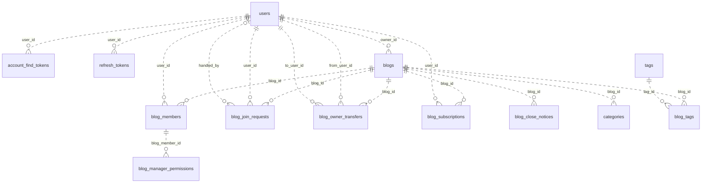
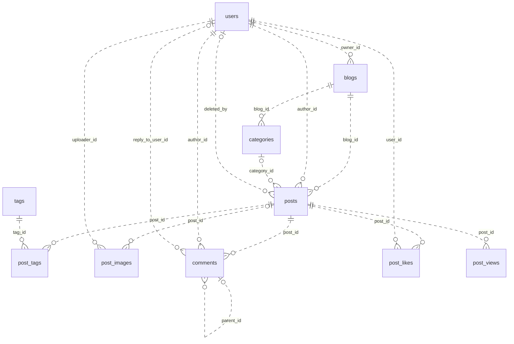
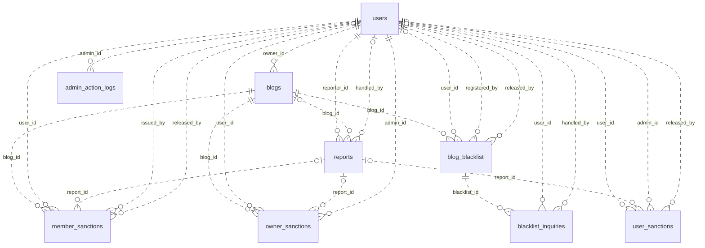
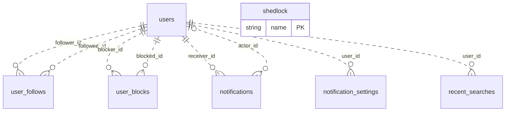

# DB 설계 (ERD)

**메인블로그 요구사항 분석서 · DB 설계 (ERD)**

**목차** (제목을 누르면 그 위치로 이동합니다)

- [인덱스 메모 (나중에 추가)](#인덱스-메모-나중에-추가)
- [관계](#관계)
- [타입 설명](#타입-설명)
- [테이블](#테이블)
  - [회원·인증](#회원인증)
  - [블로그](#블로그)
  - [제재·신고](#제재신고)
  - [게시판](#게시판)
  - [소셜·알림](#소셜알림)
  - [시스템](#시스템)

2026-10-06 기준 요구사항(3·4·6장)으로 다시 설계했습니다. MySQL 8, 테이블 33개, 관계 65개입니다. ERDCloud에 옮겨 그리기 쉽도록 테이블마다 컬럼 표를 두었고, 나중에 추가할 인덱스는 아래 메모에 따로 모았습니다.

- **표기**: PK = 기본키, FK = 외래키, UK = 중복 불가(UNIQUE). NULL 칸의 O는 비어 있어도 됨, X는 꼭 있어야 함.
- **관계 선**: 모든 테이블이 자기 id를 PK로 쓰므로 ERDCloud에서는 모두 **비식별 관계(점선)** 로 그립니다. FK가 NULL 불가면 "1 : N 필수", NULL 가능이면 "0..1 : N 선택"입니다.
- **삭제**: 회원·블로그·글·댓글은 행을 바로 지우지 않고 상태값과 삭제 시각을 남긴 뒤, 30일 뒤 새벽 4시 배치가 지웁니다(4.5).

## 인덱스 메모 (나중에 추가)

ERDCloud의 메모에 그대로 붙여 넣을 수 있게 글자로만 적었습니다. PK·UNIQUE·FK는 테이블 표에 이미 있고, 여기에는 목록·검색·배치를 빠르게 하려고 **나중에 추가할 인덱스만** 있습니다. 복합 인덱스는 =로 찾는 컬럼을 앞에, 정렬하는 컬럼을 맨 뒤에 둡니다.

```text
[users] 회원
  - idx_users_find_email (name, phone) : 이메일 찾기 (USR-08): 이름 + 전화번호
  - idx_users_created (created_at) : 일별 가입 통계 (ADM-05)
  - idx_users_withdrawn (status, withdrawn_at) : 새벽 4시 배치: 탈퇴 30일 지난 회원 찾기

[verification_codes] 이메일 인증번호
  - idx_verif_email (email, purpose, created_at) : 가장 최근 번호 찾기, 1분 재발송 제한
  - idx_verif_expires (expires_at) : 만료된 번호 삭제

[account_find_tokens] 이메일 찾기 임시 토큰
  - idx_find_tokens_expires (expires_at) : 만료 토큰 삭제

[refresh_tokens] Refresh Token
  - idx_refresh_user (user_id, revoked_at) : 비밀번호 변경 때 그 회원의 토큰 모두 폐기
  - idx_refresh_expires (expires_at) : 새벽 4시 배치: 만료 토큰 삭제 (D-83)

[blogs] 블로그
  - idx_blogs_list (visibility, status, created_at) : 메인 블로그 목록 최신순 (BLG-02)
  - idx_blogs_popular (visibility, status, member_count) : 메인 블로그 목록 인기순 = 멤버 수 (BLG-02, D-89)
  - idx_blogs_owner (owner_id, visibility, status) : 생성 개수 세기 (BLG-10)
  - idx_blogs_close (status, close_scheduled_at) : 새벽 4시 배치: 폐쇄할 블로그·3일 전·1일 전 알림
  - idx_blogs_closed (status, closed_at) : 새벽 4시 배치: 폐쇄 30일 지난 블로그 내용 삭제
  - ft_blogs_search FULLTEXT ngram (name, description) : 블로그 검색 (BLG-03, BRD-08), ngram

[blog_members] 블로그 멤버
  - idx_blog_members_user (user_id, role) : 내 블로그 목록 (BLG-06), 탈퇴 전 운영 중인 블로그 확인
  - idx_blog_members_role (blog_id, role, manager_since) : 부블로그장 찾기, 자동 위임 대상

[blog_join_requests] 참여 신청
  - idx_join_req_blog (blog_id, status, created_at) : 블로그장이 보는 대기 신청 목록
  - idx_join_req_user (user_id, blog_id, status) : 대기 중 신청·거절 7일 확인

[blog_owner_transfers] 블로그장 위임 요청
  - idx_transfer_blog (blog_id, status) : 대기 중 요청 확인 (블로그당 1개)
  - idx_transfer_to (to_user_id, status) : 받은 위임 요청
  - idx_transfer_expires (status, expires_at) : 새벽 4시 배치: 7일 지난 요청 자동 취소

[blog_subscriptions] 블로그 구독
  - idx_blog_subs_user (user_id, created_at) : 내 구독 목록, 메인 피드 구독 탭

[blog_tags] 블로그 태그
  - idx_blog_tags_tag (tag_id) : 태그로 블로그 찾기

[member_sanctions] 멤버 경고·정지·강제 퇴장
  - idx_member_sanc (blog_id, user_id, type) : 멤버별 정지 횟수·이력
  - idx_member_sanc_created (created_at) : 1년 지난 기록 삭제

[owner_sanctions] 블로그장 경고·권한 박탈
  - idx_owner_sanc (blog_id, user_id, type) : 경고 3번 세기
  - idx_owner_sanc_created (created_at) : 1년 지난 기록 삭제

[user_sanctions] 계정 경고·프로필 초기화·정지
  - idx_user_sanc (user_id, type) : 회원별 계정 제재 이력
  - idx_user_sanc_created (created_at) : 1년 지난 기록 삭제

[blog_blacklist] 블로그 블랙리스트
  - idx_blacklist_email (blog_id, email_hash) : 참여 신청 때 이메일 확인
  - idx_blacklist_phone (blog_id, phone_hash) : 참여 신청 때 전화번호 확인

[blacklist_inquiries] 블랙리스트 해제 문의
  - idx_inquiry_status (blacklist_id, status) : 블로그장이 보는 대기 문의

[reports] 신고
  - idx_reports_dup (reporter_id, target_type, target_id, created_at) : 같은 대상 2주 안 재신고 확인
  - idx_reports_blog (blog_id, status, created_at) : 블로그장이 보는 신고 목록
  - idx_reports_admin (handler_scope, status, created_at) : 관리자가 보는 신고 목록
  - idx_reports_target (target_type, target_id) : 대상별 신고 모아보기
  - idx_reports_created (created_at) : 1년 지난 기록 삭제

[admin_action_logs] 관리자 활동 기록
  - idx_admin_logs_admin (admin_id, created_at) : 관리자별 기록
  - idx_admin_logs_target (target_type, target_id) : 대상별 기록
  - idx_admin_logs_created (created_at) : 1년 지난 기록 삭제

[posts] 게시글
  - idx_posts_blog (blog_id, status, created_at) : 블로그 글 목록 최신순 (BRD-02)
  - idx_posts_category (blog_id, category_id, status, created_at) : 카테고리별 목록
  - idx_posts_author (author_id, status, created_at) : 팔로우 피드, 내 글
  - idx_posts_feed (status, created_at) : 메인 피드 최신 글 (BRD-09)
  - idx_posts_popular (status, like_count) : 인기 글 = 좋아요 수 (BRD-09, D-89)
  - idx_posts_deleted (status, deleted_at) : 새벽 4시 배치: 삭제 30일 지난 글
  - ft_posts_title FULLTEXT ngram (title) : 글 제목 검색 (BRD-08), ngram

[post_tags] 글-태그 연결
  - idx_post_tags_tag (tag_id, post_id) : 태그 눌러 글 찾기

[post_images] 글 이미지
  - idx_post_images_post (post_id, sort_order) : 글의 이미지 순서대로
  - idx_post_images_orphan (post_id, created_at) : 글에 연결 안 된 이미지 정리

[comments] 댓글
  - idx_comments_post (post_id, parent_id, created_at) : 글의 댓글·대댓글 순서대로
  - idx_comments_author (author_id, created_at) : 내 댓글

[post_views] 조회 기록
  - idx_post_views_date (view_date) : 오래된 조회 기록 정리

[user_follows] 회원 팔로우
  - idx_follows_followee (followee_id, created_at) : 팔로워 목록

[user_blocks] 회원 차단
  - idx_blocks_blocked (blocked_id) : 나를 차단한 사람 확인

[notifications] 알림
  - idx_notif_receiver (receiver_id, tab, created_at) : 사이드바 탭별 목록
  - idx_notif_unread (receiver_id, is_read) : 30초 폴링: 안 읽은 알림 수
  - idx_notif_created (created_at) : 보관 기간 지난 알림 삭제

[recent_searches] 최근 검색어
  - idx_recent_search (user_id, searched_at) : 최근 10개
```

## 관계

회원(users)과 블로그(blogs)가 중심입니다. 회원과 블로그는 blog_members로 이어지고, 이 테이블의 role이 블로그장·부블로그장·멤버를 가릅니다. reports·notifications·admin_action_logs의 target_id는 회원·블로그·글·댓글 중 하나를 가리켜서 FK를 걸 수 없고, target_type으로 구분합니다.

### 관계도 · 회원·블로그

점선 = 비식별 관계, `||` 필수 · `|o` 선택(NULL 가능), 까마귀발 = 여러 개



### 관계도 · 게시판

점선 = 비식별 관계, `||` 필수 · `|o` 선택(NULL 가능), 까마귀발 = 여러 개



### 관계도 · 제재·신고

점선 = 비식별 관계, `||` 필수 · `|o` 선택(NULL 가능), 까마귀발 = 여러 개



### 관계도 · 소셜·알림·시스템

점선 = 비식별 관계, `||` 필수 · `|o` 선택(NULL 가능), 까마귀발 = 여러 개



**식별 관계와 비식별 관계**: 부모의 PK가 자식의 PK 안에 들어가면 식별 관계(실선), 자식의 일반 칸에만 들어가면 비식별 관계(점선)입니다. 이 ERD는 65개 모두 비식별입니다. 모든 테이블이 자기 id 하나를 PK로 쓰고(JPA에서 가장 간단), 다른 테이블이 id 하나로 가리킬 수 있으며, parent_id·handled_by처럼 비어 있을 수 있는 FK가 많기 때문입니다(식별 관계는 FK가 PK라 NULL이 될 수 없음). 식별 관계가 PK로 막아 주던 중복은 UNIQUE로 막습니다(예: blog_members의 (blog_id, user_id)). 한 테이블이 users를 여러 번 가리키는 경우(예: blog_blacklist의 user_id·registered_by·released_by)는 칸마다 다른 역할의 회원입니다.

| 부모 테이블 | 자식 테이블 | 연결 컬럼 (FK) | 식별 여부 | 관계 | 뜻 |
|---|---|---|---|---|---|
| users | account_find_tokens | user_id | 비식별 (점선) | 1 : N 필수 | 찾은 계정 |
| users | refresh_tokens | user_id | 비식별 (점선) | 1 : N 필수 | 토큰 주인 |
| users | blogs | owner_id | 비식별 (점선) | 1 : N 필수 | 블로그장 (blog_members의 OWNER와 같은 사람) |
| blogs | blog_members | blog_id | 비식별 (점선) | 1 : N 필수 | 블로그 |
| users | blog_members | user_id | 비식별 (점선) | 1 : N 필수 | 회원 |
| blog_members | blog_manager_permissions | blog_member_id | 비식별 (점선) | 1 : N 필수 | 부블로그장인 멤버 행 |
| blogs | blog_join_requests | blog_id | 비식별 (점선) | 1 : N 필수 | 신청한 블로그 |
| users | blog_join_requests | user_id | 비식별 (점선) | 1 : N 필수 | 신청한 회원 |
| users | blog_join_requests | handled_by | 비식별 (점선) | 0..1 : N 선택 | 처리한 블로그장·부블로그장 |
| blogs | blog_owner_transfers | blog_id | 비식별 (점선) | 1 : N 필수 | 블로그 |
| users | blog_owner_transfers | from_user_id | 비식별 (점선) | 1 : N 필수 | 요청한 블로그장 |
| users | blog_owner_transfers | to_user_id | 비식별 (점선) | 1 : N 필수 | 받는 멤버 |
| blogs | blog_subscriptions | blog_id | 비식별 (점선) | 1 : N 필수 | 구독한 블로그 |
| users | blog_subscriptions | user_id | 비식별 (점선) | 1 : N 필수 | 구독한 회원 |
| blogs | blog_close_notices | blog_id | 비식별 (점선) | 1 : N 필수 | 블로그 |
| blogs | categories | blog_id | 비식별 (점선) | 1 : N 필수 | 블로그 |
| blogs | blog_tags | blog_id | 비식별 (점선) | 1 : N 필수 | 블로그 |
| tags | blog_tags | tag_id | 비식별 (점선) | 1 : N 필수 | 태그 |
| blogs | member_sanctions | blog_id | 비식별 (점선) | 1 : N 필수 | 블로그 |
| users | member_sanctions | user_id | 비식별 (점선) | 1 : N 필수 | 대상 멤버 |
| reports | member_sanctions | report_id | 비식별 (점선) | 0..1 : N 선택 | 신고를 처리하며 준 경우 그 신고 |
| users | member_sanctions | issued_by | 비식별 (점선) | 1 : N 필수 | 조치한 블로그장·부블로그장 |
| users | member_sanctions | released_by | 비식별 (점선) | 0..1 : N 선택 | 해제한 사람 |
| blogs | owner_sanctions | blog_id | 비식별 (점선) | 1 : N 필수 | 블로그 |
| users | owner_sanctions | user_id | 비식별 (점선) | 1 : N 필수 | 대상 블로그장 |
| reports | owner_sanctions | report_id | 비식별 (점선) | 0..1 : N 선택 | 신고를 처리하며 준 경우 |
| users | owner_sanctions | admin_id | 비식별 (점선) | 1 : N 필수 | 조치한 메인 관리자 |
| users | user_sanctions | user_id | 비식별 (점선) | 1 : N 필수 | 대상 회원 |
| reports | user_sanctions | report_id | 비식별 (점선) | 0..1 : N 선택 | 신고를 처리하며 준 경우 그 신고 |
| users | user_sanctions | admin_id | 비식별 (점선) | 1 : N 필수 | 조치한 메인 관리자 |
| users | user_sanctions | released_by | 비식별 (점선) | 0..1 : N 선택 | 해제한 관리자 |
| blogs | blog_blacklist | blog_id | 비식별 (점선) | 1 : N 필수 | 블로그 |
| users | blog_blacklist | user_id | 비식별 (점선) | 0..1 : N 선택 | 강퇴된 회원 (탈퇴하면 NULL이 될 수 있음) |
| users | blog_blacklist | registered_by | 비식별 (점선) | 1 : N 필수 | 등록한 블로그장·부블로그장 |
| users | blog_blacklist | released_by | 비식별 (점선) | 0..1 : N 선택 | 해제한 사람 |
| blog_blacklist | blacklist_inquiries | blacklist_id | 비식별 (점선) | 1 : N 필수 | 걸린 블랙리스트 기록 |
| users | blacklist_inquiries | user_id | 비식별 (점선) | 1 : N 필수 | 문의한 회원 |
| users | blacklist_inquiries | handled_by | 비식별 (점선) | 0..1 : N 선택 | 처리한 블로그장 |
| users | reports | reporter_id | 비식별 (점선) | 1 : N 필수 | 신고한 회원 |
| blogs | reports | blog_id | 비식별 (점선) | 0..1 : N 선택 | 블로그 안의 신고면 그 블로그 (블로그장이 처리) |
| users | reports | handled_by | 비식별 (점선) | 0..1 : N 선택 | 처리한 사람 |
| users | admin_action_logs | admin_id | 비식별 (점선) | 1 : N 필수 | 조치한 관리자 |
| blogs | posts | blog_id | 비식별 (점선) | 1 : N 필수 | 블로그 (메인 공지는 main 블로그) |
| users | posts | author_id | 비식별 (점선) | 1 : N 필수 | 작성자 |
| categories | posts | category_id | 비식별 (점선) | 0..1 : N 선택 | 카테고리 (없을 수 있음) |
| users | posts | deleted_by | 비식별 (점선) | 0..1 : N 선택 | 삭제한 사람 (본인·블로그장·관리자) |
| posts | post_tags | post_id | 비식별 (점선) | 1 : N 필수 | 글 |
| tags | post_tags | tag_id | 비식별 (점선) | 1 : N 필수 | 태그 |
| posts | post_images | post_id | 비식별 (점선) | 0..1 : N 선택 | 글 (글 저장 전 업로드면 NULL) |
| users | post_images | uploader_id | 비식별 (점선) | 1 : N 필수 | 올린 회원 |
| posts | comments | post_id | 비식별 (점선) | 1 : N 필수 | 글 |
| users | comments | author_id | 비식별 (점선) | 1 : N 필수 | 작성자 |
| comments | comments | parent_id | 비식별 (점선) | 0..1 : N 선택 | 대댓글이면 부모 댓글 (1단계까지) |
| users | comments | reply_to_user_id | 비식별 (점선) | 0..1 : N 선택 | 대댓글이 답하는 회원 (@닉네임 표시, D-87) |
| posts | post_likes | post_id | 비식별 (점선) | 1 : N 필수 | 글 |
| users | post_likes | user_id | 비식별 (점선) | 1 : N 필수 | 누른 회원 |
| posts | post_views | post_id | 비식별 (점선) | 1 : N 필수 | 글 |
| users | user_follows | follower_id | 비식별 (점선) | 1 : N 필수 | 팔로우하는 회원 |
| users | user_follows | followee_id | 비식별 (점선) | 1 : N 필수 | 팔로우받는 회원 |
| users | user_blocks | blocker_id | 비식별 (점선) | 1 : N 필수 | 차단한 회원 |
| users | user_blocks | blocked_id | 비식별 (점선) | 1 : N 필수 | 차단당한 회원 |
| users | notifications | receiver_id | 비식별 (점선) | 1 : N 필수 | 받는 회원 |
| users | notifications | actor_id | 비식별 (점선) | 0..1 : N 선택 | 알림을 일으킨 회원 (시스템 알림은 NULL) |
| users | notification_settings | user_id | 비식별 (점선) | 1 : N 필수 | 회원 |
| users | recent_searches | user_id | 비식별 (점선) | 1 : N 필수 | 회원 (본인만 봄) |

## 타입 설명

이 ERD에서 쓰는 MySQL 8 타입입니다. 문자는 utf8mb4 기준이라 영어·숫자는 1바이트, 한글은 3바이트, 이모지는 4바이트입니다. 범위가 넓을수록 저장 공간을 더 쓰므로, 들어갈 값에 맞는 가장 작은 타입을 골랐습니다.

| 분류 | 타입 | 크기 | 범위·최대 길이 | Java(JPA) 타입 | 이 ERD에서 쓰는 곳 |
|---|---|---|---|---|---|
| 정수 | TINYINT | 1바이트 | -128 ~ 127 | Integer | notification_keep_days(7·30), fail_count(0\~5), post_images.sort_order(0\~9) |
| 정수 | SMALLINT | 2바이트 | -32,768 ~ 32,767 | Integer | member_sanctions.suspend_days(3·14·30) |
| 정수 | INT | 4바이트 | 약 ±21억 (-2,147,483,648 ~ 2,147,483,647) | Integer | 조회수·좋아요 수·멤버 수 같은 개수, 로그인 실패 횟수, 이미지 크기 (size_bytes) |
| 정수 | BIGINT | 8바이트 | 약 ±922경 | Long | 모든 id와 FK. 알림·조회 기록처럼 계속 쌓이는 테이블은 21억을 넘을 수 있어 처음부터 넉넉하게 잡음 |
| 참/거짓 | BOOLEAN | 1바이트 | TRUE / FALSE (MySQL 안에서는 TINYINT(1)) | Boolean | is_hidden, is_read, remember_me, name_match 등 |
| 문자 | VARCHAR(n) | 저장한 글자만큼 | 최대 n글자 (한 행 전체가 65,535바이트 안이어야 함) | String | 이메일, 닉네임(12), 제목(30), 댓글(500), 해시값처럼 길이가 정해진 값 |
| 문자 | TEXT | 최대 64KB | 한글 약 21,800자, 이모지만 쓰면 약 16,300자 | String | posts.content (본문 5,000자, D-92) |
| 선택값 | ENUM(...) | 1바이트 | 정해 둔 값 중 하나만 저장 | enum (@Enumerated(STRING)) | status, role, visibility, type 등 |
| 날짜·시각 | DATETIME | 5바이트 | 1000-01-01 ~ 9999-12-31 | LocalDateTime | created_at, expires_at 등 (9999-12-31은 영구 정지 표시) |
| 날짜 | DATE | 3바이트 | 날짜만 (시각 없음) | LocalDate | post_views.view_date (같은 사람 하루 1번 세기) |
| 날짜·시각 | TIMESTAMP(3) | 6바이트 | 1970 ~ 2038년, 밀리초까지 | (라이브러리가 처리) | shedlock의 잠금 시각 (ShedLock이 정한 형식) |

짧고 길이가 정해진 값은 VARCHAR, 길이가 바뀔 수 있는 긴 본문은 TEXT를 씁니다. TEXT 칸의 글자 수 제한은 DB가 막지 않으므로 서버 검증(@Size)으로 지킵니다. ENUM은 JPA에서 꼭 @Enumerated(EnumType.STRING)을 써야 합니다. 기본값(ORDINAL)은 순서 번호로 저장해서, 값의 순서를 바꾸면 데이터가 어긋납니다.

## 테이블

### 회원·인증

#### users (회원) · USR-01\~08, SEC-01\~05, 4.5, 4.6

| 컬럼 | 타입 | 키 | NULL | 기본값 | 설명 |
|---|---|---|---|---|---|
| id | BIGINT | PK | X | AUTO_INCREMENT | 번호 |
| email | VARCHAR(100) | UK | O |  | 로그인 아이디. 소문자로 저장. 탈퇴 즉시 NULL (같은 이메일로 바로 재가입) |
| password_hash | VARCHAR(100) |  | X |  | bcrypt 해시 |
| name | VARCHAR(30) |  | O |  | 이름. 바꿀 수 없음. 탈퇴 30일 뒤 NULL |
| nickname | VARCHAR(12) | UK | O |  | 2\~12자. 탈퇴 30일 뒤 NULL |
| phone | VARCHAR(11) |  | O |  | 숫자만. 1차는 중복 허용. 탈퇴 30일 뒤 NULL |
| profile_image | VARCHAR(255) |  | O |  | 프로필 사진 저장 경로 (UUID 이름) |
| bio | VARCHAR(200) |  | O |  | 소개 |
| role | ENUM('USER','ADMIN') |  | X | 'USER' | ADMIN = 메인 관리자 (블로그 활동은 못 함, D-90) |
| status | ENUM('ACTIVE','WITHDRAWN') |  | X | 'ACTIVE' | 탈퇴하면 행을 지우지 않고 WITHDRAWN |
| suspended_until | DATETIME |  | O |  | 메인 관리자 계정 정지가 끝나는 시각 (ADM-08). 영구 정지는 9999-12-31. 정지 아니면 NULL |
| login_fail_count | INT |  | X | 0 | 연속 로그인 실패 횟수 (5회면 잠금, 3회부터 CAPTCHA) |
| locked_until | DATETIME |  | O |  | 로그인 잠금 풀리는 시각 (5분) |
| notification_keep_days | TINYINT |  | X | 30 | 알림 보관 일수 (30 또는 7) |
| terms_agreed_at | DATETIME |  | X |  | 이용약관 동의 시각 |
| privacy_agreed_at | DATETIME |  | X |  | 개인정보 수집·이용 동의 시각 |
| withdrawn_at | DATETIME |  | O |  | 탈퇴 시각 (30일 뒤 개인정보 삭제 기준) |
| created_at | DATETIME |  | X | CURRENT_TIMESTAMP | 만든 시각 |
| updated_at | DATETIME |  | X | CURRENT_TIMESTAMP | 고친 시각 (ON UPDATE) |

#### verification_codes (이메일 인증번호) · USR-02, USR-06, USR-08

| 컬럼 | 타입 | 키 | NULL | 기본값 | 설명 |
|---|---|---|---|---|---|
| id | BIGINT | PK | X | AUTO_INCREMENT | 번호 |
| email | VARCHAR(100) |  | X |  | 가입 전이라 회원 번호 대신 이메일 기준 |
| purpose | ENUM('SIGNUP','PASSWORD_RESET') |  | X |  | 가입 인증 / 비밀번호 재설정 |
| code_hash | VARCHAR(100) |  | X |  | 6자리 번호의 해시 |
| fail_count | TINYINT |  | X | 0 | 5번 틀리면 무효 |
| expires_at | DATETIME |  | X |  | 가입 10분, 재설정 30분 |
| verified_at | DATETIME |  | O |  | 맞게 입력한 시각 (가입 마지막 단계에서 다시 확인) |
| used_at | DATETIME |  | O |  | 사용한 시각 (1회용) |
| created_at | DATETIME |  | X | CURRENT_TIMESTAMP | 만든 시각 |

회원과 FK로 잇지 않습니다. 가입 전에는 회원 번호가 없기 때문입니다.

#### account_find_tokens (이메일 찾기 임시 토큰) · USR-08

| 컬럼 | 타입 | 키 | NULL | 기본값 | 설명 |
|---|---|---|---|---|---|
| id | BIGINT | PK | X | AUTO_INCREMENT | 번호 |
| user_id | BIGINT | FK → users | X |  | 찾은 계정 |
| token_hash | VARCHAR(100) | UK | X |  | 임시 토큰 해시 (비밀번호 재설정 요청에 씀) |
| expires_at | DATETIME |  | X |  | 10분 |
| created_at | DATETIME |  | X | CURRENT_TIMESTAMP | 만든 시각 |

user_id는 이 임시 토큰이 어느 회원 계정 것인지 가리킵니다. 이메일 찾기(USR-08)는 이렇게 쓰입니다.

1. 이름과 전화번호로 계정을 찾으면, 화면에는 가린 이메일(ab\*\*\*@gmail.com)만 보여주고 계정마다 임시 토큰을 하나씩 만들어 같이 내려보냅니다. DB에는 토큰 해시와 그 계정의 user_id를 저장합니다.
2. [비밀번호 재설정]을 누르면 화면은 토큰만 보냅니다. 서버는 토큰으로 이 테이블을 찾고, user_id로 그 회원의 진짜 이메일에 인증번호를 보냅니다.

회원 번호나 이메일 원문을 화면에 주지 않는 이유: 이메일은 가려서 보여줘야 하고(4.4), 회원 번호를 주면 다른 번호로 바꿔 남의 계정에 재설정 메일을 보내게 할 수 있습니다. 토큰은 무작위 값이라 추측할 수 없고 10분 뒤 만료됩니다. 이름·전화번호가 같은 계정이 여러 개면 계정마다 토큰이 따로 생기므로 users 1 : N 관계입니다. 가입 인증번호(verification_codes)와 달리 FK를 건 것은, 이메일 찾기는 이미 가입한 회원을 대상으로 하기 때문입니다.

#### refresh_tokens (Refresh Token) · SEC-04, USR-04, D-82, D-83

| 컬럼 | 타입 | 키 | NULL | 기본값 | 설명 |
|---|---|---|---|---|---|
| id | BIGINT | PK | X | AUTO_INCREMENT | 번호 |
| user_id | BIGINT | FK → users | X |  | 토큰 주인 |
| token_hash | VARCHAR(100) | UK | X |  | 토큰 해시 (원문 저장 안 함) |
| remember_me | BOOLEAN |  | X | FALSE | "로그인 유지" 체크 여부 (14일 / 30분) |
| user_agent | VARCHAR(255) |  | O |  | 기기 구분용 |
| expires_at | DATETIME |  | X |  | 만료 시각 |
| revoked_at | DATETIME |  | O |  | 로그아웃·비밀번호 변경 때 폐기한 시각 |
| created_at | DATETIME |  | X | CURRENT_TIMESTAMP | 만든 시각 |

### 블로그

#### blogs (블로그) · BLG-01\~03, BLG-09\~10, ADM-02

| 컬럼 | 타입 | 키 | NULL | 기본값 | 설명 |
|---|---|---|---|---|---|
| id | BIGINT | PK | X | AUTO_INCREMENT | 번호 |
| owner_id | BIGINT | FK → users | X |  | 블로그장 (blog_members의 OWNER와 같은 사람) |
| slug | VARCHAR(30) | UK | O |  | 블로그 주소 /blog/{slug}. 영문 소문자·숫자·-. 폐쇄 30일 뒤 NULL로 비워 다른 사람이 쓸 수 있게 함 (D-86) |
| name | VARCHAR(50) |  | X |  | 블로그 이름 (중복 허용) |
| description | VARCHAR(500) |  | O |  | 소개 |
| cover_image | VARCHAR(255) |  | O |  | 대표 이미지 경로 |
| visibility | ENUM('PUBLIC','LINK_ONLY','PRIVATE') |  | X | 'PUBLIC' | 공개 / 일부 공개 / 비공개 |
| share_key | VARCHAR(64) | UK | O |  | 일부 공개 공유 링크의 무작위 값. 새로 만들면 이전 값 무효 |
| join_policy | ENUM('OPEN','APPROVAL') |  | X | 'OPEN' | 자유 참여 / 승인제 |
| status | ENUM('ACTIVE','CLOSING','CLOSED') |  | X | 'ACTIVE' | 운영 중 / 폐쇄 예정(7일) / 폐쇄 |
| is_hidden | BOOLEAN |  | X | FALSE | 관리자가 숨김 (ADM-02) |
| close_scheduled_at | DATETIME |  | O |  | 폐쇄 예정 시각 (7일 뒤 04:00). 철회하면 NULL |
| close_reason | ENUM('OWNER','OWNER_DEMOTED','ADMIN') |  | O |  | 블로그장 폐쇄 / 블로그장 박탈 / 관리자 강제 폐쇄 |
| closed_at | DATETIME |  | O |  | 폐쇄된 시각 (30일 뒤 글·사진·카테고리 삭제, 행은 남김) |
| member_count | INT |  | X | 1 | 멤버 수 (인기순 정렬용) |
| post_count | INT |  | X | 0 | 글 수 |
| subscriber_count | INT |  | X | 0 | 구독자 수 |
| created_at | DATETIME |  | X | CURRENT_TIMESTAMP | 만든 시각 |
| updated_at | DATETIME |  | X | CURRENT_TIMESTAMP | 고친 시각 (ON UPDATE) |

메인블로그도 이 테이블의 한 행(slug = main, 블로그장 = 메인 관리자)입니다. 공지사항(BRD-10)이 이 블로그의 글이 됩니다. 폐쇄된 블로그는 30일 뒤 글·사진·카테고리·블랙리스트만 지우고 행은 남깁니다. 1년 보관하는 제재·신고 기록이 이 행을 가리키기 때문입니다(D-86).

#### blog_members (블로그 멤버) · BLG-04\~08, BLG-13, 2장

| 컬럼 | 타입 | 키 | NULL | 기본값 | 설명 |
|---|---|---|---|---|---|
| id | BIGINT | PK | X | AUTO_INCREMENT | 번호 |
| blog_id | BIGINT | FK → blogs | X |  | 블로그 |
| user_id | BIGINT | FK → users | X |  | 회원 |
| role | ENUM('OWNER','MANAGER','MEMBER') |  | X | 'MEMBER' | 블로그장 / 부블로그장 / 멤버 |
| manager_since | DATETIME |  | O |  | 부블로그장이 된 시각 (자동 위임 순서, ADM-07) |
| suspended_until | DATETIME |  | O |  | 정지 끝나는 시각. 영구 정지는 9999-12-31. 정지 아니면 NULL |
| suspension_count | INT |  | X | 0 | 이 블로그에서 받은 정지 횟수 (3번이면 블로그장 화면에 표시) |
| joined_at | DATETIME |  | X | CURRENT_TIMESTAMP | 참여 시각 |

묶음 UNIQUE: uk_blog_members (blog_id, user_id) 같은 블로그에 두 번 참여 금지

#### blog_manager_permissions (부블로그장 권한) · D-71, 2장

| 컬럼 | 타입 | 키 | NULL | 기본값 | 설명 |
|---|---|---|---|---|---|
| id | BIGINT | PK | X | AUTO_INCREMENT | 번호 |
| blog_member_id | BIGINT | FK → blog_members | X |  | 부블로그장인 멤버 행 |
| permission | ENUM('EDIT_INFO','MANAGE_MEMBERS','MANAGE_POSTS') |  | X |  | 블로그 정보 수정 / 멤버 관리 / 글 관리 |
| granted_at | DATETIME |  | X | CURRENT_TIMESTAMP | 권한 준 시각 |

묶음 UNIQUE: uk_manager_perm (blog_member_id, permission) 같은 권한 두 번 금지

#### blog_join_requests (참여 신청) · BLG-04, BLG-05, 6.5

| 컬럼 | 타입 | 키 | NULL | 기본값 | 설명 |
|---|---|---|---|---|---|
| id | BIGINT | PK | X | AUTO_INCREMENT | 번호 |
| blog_id | BIGINT | FK → blogs | X |  | 신청한 블로그 |
| user_id | BIGINT | FK → users | X |  | 신청한 회원 |
| status | ENUM('PENDING','APPROVED','REJECTED','CANCELED') |  | X | 'PENDING' | 대기 / 승인 / 거절 / 신청 취소 |
| handled_by | BIGINT | FK → users | O |  | 처리한 블로그장·부블로그장 |
| handled_at | DATETIME |  | O |  | 처리 시각 (거절 7일 뒤 재신청 기준) |
| created_at | DATETIME |  | X | CURRENT_TIMESTAMP | 만든 시각 |

#### blog_owner_transfers (블로그장 위임 요청) · BLG-08

| 컬럼 | 타입 | 키 | NULL | 기본값 | 설명 |
|---|---|---|---|---|---|
| id | BIGINT | PK | X | AUTO_INCREMENT | 번호 |
| blog_id | BIGINT | FK → blogs | X |  | 블로그 |
| from_user_id | BIGINT | FK → users | X |  | 요청한 블로그장 |
| to_user_id | BIGINT | FK → users | X |  | 받는 멤버 |
| status | ENUM('PENDING','ACCEPTED','REJECTED','CANCELED','EXPIRED') |  | X | 'PENDING' | 대기 / 수락 / 거절 / 폐쇄로 취소 / 7일 지나 자동 취소 |
| expires_at | DATETIME |  | X |  | 요청 + 7일 |
| responded_at | DATETIME |  | O |  | 응답 시각 |
| created_at | DATETIME |  | X | CURRENT_TIMESTAMP | 만든 시각 |

#### blog_subscriptions (블로그 구독) · SOC-01, BLG-01

| 컬럼 | 타입 | 키 | NULL | 기본값 | 설명 |
|---|---|---|---|---|---|
| id | BIGINT | PK | X | AUTO_INCREMENT | 번호 |
| blog_id | BIGINT | FK → blogs | X |  | 구독한 블로그 |
| user_id | BIGINT | FK → users | X |  | 구독한 회원 |
| created_at | DATETIME |  | X | CURRENT_TIMESTAMP | 만든 시각 |

묶음 UNIQUE: uk_blog_subs (blog_id, user_id) 중복 구독 금지

#### blog_close_notices (폐쇄 알림 발송 기록) · BLG-09, SOC-04

| 컬럼 | 타입 | 키 | NULL | 기본값 | 설명 |
|---|---|---|---|---|---|
| id | BIGINT | PK | X | AUTO_INCREMENT | 번호 |
| blog_id | BIGINT | FK → blogs | X |  | 블로그 |
| close_scheduled_at | DATETIME |  | X |  | 어느 폐쇄 예정에 대한 알림인지 (철회 후 다시 누르면 새 값) |
| stage | ENUM('IMMEDIATE','D3','D1','REVOKED') |  | X |  | 즉시 / 3일 전 / 1일 전 / 철회 |
| sent_at | DATETIME |  | X | CURRENT_TIMESTAMP | 보낸 시각 |

묶음 UNIQUE: uk_close_notice (blog_id, close_scheduled_at, stage) 같은 알림 두 번 발송 금지

#### categories (카테고리) · BRD-03

| 컬럼 | 타입 | 키 | NULL | 기본값 | 설명 |
|---|---|---|---|---|---|
| id | BIGINT | PK | X | AUTO_INCREMENT | 번호 |
| blog_id | BIGINT | FK → blogs | X |  | 블로그 |
| name | VARCHAR(30) |  | X |  | 카테고리 이름 |
| sort_order | INT |  | X | 0 | 표시 순서 |
| created_at | DATETIME |  | X | CURRENT_TIMESTAMP | 만든 시각 |

묶음 UNIQUE: uk_categories (blog_id, name) 같은 블로그 안 이름 중복 금지

#### blog_tags (블로그 태그) · BLG-03

| 컬럼 | 타입 | 키 | NULL | 기본값 | 설명 |
|---|---|---|---|---|---|
| id | BIGINT | PK | X | AUTO_INCREMENT | 번호 |
| blog_id | BIGINT | FK → blogs | X |  | 블로그 |
| tag_id | BIGINT | FK → tags | X |  | 태그 |

묶음 UNIQUE: uk_blog_tags (blog_id, tag_id) 중복 금지

### 제재·신고

#### member_sanctions (멤버 경고·정지·강제 퇴장) · BLG-13, 3.7, 4.5

| 컬럼 | 타입 | 키 | NULL | 기본값 | 설명 |
|---|---|---|---|---|---|
| id | BIGINT | PK | X | AUTO_INCREMENT | 번호 |
| blog_id | BIGINT | FK → blogs | X |  | 블로그 |
| user_id | BIGINT | FK → users | X |  | 대상 멤버 |
| type | ENUM('WARNING','SUSPENSION','KICK') |  | X |  | 경고 / 정지 / 강제 퇴장 |
| suspend_days | SMALLINT |  | O |  | 3, 14, 30. 영구는 NULL (정지일 때만) |
| ends_at | DATETIME |  | O |  | 정지 끝나는 시각 |
| reason | VARCHAR(500) |  | X |  | 사유 |
| report_id | BIGINT | FK → reports | O |  | 신고를 처리하며 준 경우 그 신고 |
| issued_by | BIGINT | FK → users | X |  | 조치한 블로그장·부블로그장 (블로그장 정지 중이면 메인 관리자, ADM-08) |
| released_at | DATETIME |  | O |  | 정지 해제 시각 |
| released_by | BIGINT | FK → users | O |  | 해제한 사람 |
| created_at | DATETIME |  | X | CURRENT_TIMESTAMP | 만든 시각 |

#### owner_sanctions (블로그장 경고·권한 박탈) · ADM-07, 3.7

| 컬럼 | 타입 | 키 | NULL | 기본값 | 설명 |
|---|---|---|---|---|---|
| id | BIGINT | PK | X | AUTO_INCREMENT | 번호 |
| blog_id | BIGINT | FK → blogs | X |  | 블로그 |
| user_id | BIGINT | FK → users | X |  | 대상 블로그장 |
| type | ENUM('WARNING','DEMOTION') |  | X |  | 경고 / 권한 박탈 |
| reason | VARCHAR(500) |  | X |  | 사유 |
| report_id | BIGINT | FK → reports | O |  | 신고를 처리하며 준 경우 |
| admin_id | BIGINT | FK → users | X |  | 조치한 메인 관리자 |
| created_at | DATETIME |  | X | CURRENT_TIMESTAMP | 만든 시각 |

#### user_sanctions (계정 경고·프로필 초기화·정지) · ADM-08, 3.7, 4.5

| 컬럼 | 타입 | 키 | NULL | 기본값 | 설명 |
|---|---|---|---|---|---|
| id | BIGINT | PK | X | AUTO_INCREMENT | 번호 |
| user_id | BIGINT | FK → users | X |  | 대상 회원 |
| type | ENUM('WARNING','PROFILE_RESET','SUSPENSION') |  | X |  | 경고 / 프로필 초기화 / 계정 정지 |
| suspend_days | SMALLINT |  | O |  | 3, 14, 30. 영구는 NULL (정지일 때만) |
| ends_at | DATETIME |  | O |  | 정지 끝나는 시각 |
| reason | VARCHAR(500) |  | X |  | 사유 |
| report_id | BIGINT | FK → reports | O |  | 신고를 처리하며 준 경우 그 신고 |
| admin_id | BIGINT | FK → users | X |  | 조치한 메인 관리자 |
| released_at | DATETIME |  | O |  | 정지 해제 시각 |
| released_by | BIGINT | FK → users | O |  | 해제한 관리자 |
| created_at | DATETIME |  | X | CURRENT_TIMESTAMP | 만든 시각 |

메인 프로필 신고를 메인 관리자가 처리한 기록입니다(D-99). 정지 중인지는 요청마다 `users.suspended_until`로 확인하고, 이 표는 이력과 해제 기록을 1년 남깁니다. 정지된 회원이 블로그장이면 블로그 공지는 따로 저장하지 않고 화면이 `blogs.owner_id`의 정지 여부로 띄웁니다(D-100).

#### blog_blacklist (블로그 블랙리스트) · BLG-11, 4.6

| 컬럼 | 타입 | 키 | NULL | 기본값 | 설명 |
|---|---|---|---|---|---|
| id | BIGINT | PK | X | AUTO_INCREMENT | 번호 |
| blog_id | BIGINT | FK → blogs | X |  | 블로그 |
| user_id | BIGINT | FK → users | O |  | 강퇴된 회원 (탈퇴하면 NULL이 될 수 있음) |
| name_hash | VARCHAR(100) |  | X |  | 이름 해시 |
| email_hash | VARCHAR(100) |  | X |  | 이메일 해시 |
| phone_hash | VARCHAR(100) |  | X |  | 전화번호 해시 |
| registered_by | BIGINT | FK → users | X |  | 등록한 블로그장·부블로그장 |
| released_at | DATETIME |  | O |  | 해제 시각 (기록은 고치거나 지우지 않음) |
| released_by | BIGINT | FK → users | O |  | 해제한 사람 |
| created_at | DATETIME |  | X | CURRENT_TIMESTAMP | 만든 시각 |

#### blacklist_inquiries (블랙리스트 해제 문의) · BLG-12

| 컬럼 | 타입 | 키 | NULL | 기본값 | 설명 |
|---|---|---|---|---|---|
| id | BIGINT | PK | X | AUTO_INCREMENT | 번호 |
| blacklist_id | BIGINT | FK → blog_blacklist | X |  | 걸린 블랙리스트 기록 |
| user_id | BIGINT | FK → users | X |  | 문의한 회원 |
| name_match | BOOLEAN |  | X |  | 서버가 비교한 이름 일치 여부 |
| phone_match | BOOLEAN |  | X |  | 전화번호 일치 여부 |
| message | VARCHAR(500) |  | O |  | 문의 내용 |
| status | ENUM('PENDING','RELEASED','REJECTED') |  | X | 'PENDING' | 대기 / 해제 / 거절 |
| handled_by | BIGINT | FK → users | O |  | 처리한 블로그장 |
| handled_at | DATETIME |  | O |  | 처리 시각 |
| created_at | DATETIME |  | X | CURRENT_TIMESTAMP | 만든 시각 |

#### reports (신고) · SOC-06, ADM-04, BLG-13, 6.5

| 컬럼 | 타입 | 키 | NULL | 기본값 | 설명 |
|---|---|---|---|---|---|
| id | BIGINT | PK | X | AUTO_INCREMENT | 번호 |
| reporter_id | BIGINT | FK → users | X |  | 신고한 회원 |
| target_type | ENUM('USER','BLOG','POST','COMMENT') |  | X |  | 신고 대상 종류 |
| target_id | BIGINT |  | X |  | 대상 번호 (종류마다 테이블이 달라 FK 없음) |
| blog_id | BIGINT | FK → blogs | O |  | 블로그 안의 신고면 그 블로그 (블로그장이 처리) |
| handler_scope | ENUM('BLOG_OWNER','ADMIN') |  | X |  | 처리할 사람. 블로그장 본인·블로그장 글·댓글, 메인 프로필, 블로그장 정지 중인 블로그의 신고는 ADMIN |
| reason | ENUM('SPAM','ABUSE','ADULT','ILLEGAL','ETC') |  | X |  | 사유 |
| detail | VARCHAR(500) |  | O |  | 자세한 내용 |
| target_snapshot | VARCHAR(1000) |  | X |  | 신고 당시 대상 내용 (글 제목·본문 앞부분, 댓글 내용, 닉네임, 블로그 이름). 원본이 지워져도 1년 동안 확인 |
| status | ENUM('PENDING','NO_ISSUE','WARNED','SUSPENDED','KICKED','OWNER_DEMOTED','BLOG_CLOSED','PROFILE_RESET','ACCOUNT_SUSPENDED') |  | X | 'PENDING' | 처리 결과 |
| handled_by | BIGINT | FK → users | O |  | 처리한 사람 |
| handled_at | DATETIME |  | O |  | 처리 시각 |
| created_at | DATETIME |  | X | CURRENT_TIMESTAMP | 만든 시각 |

같은 대상을 2주 뒤 다시 신고할 수 있어야 해서 UNIQUE를 걸지 않고, 앱에서 2주 안의 신고가 있는지 확인합니다. 대상은 target_type(어느 테이블)과 target_id(몇 번 행)를 합쳐 찾고, FK가 없으므로 저장할 때 앱에서 대상이 있는지 확인합니다. 신고된 글·댓글은 삭제 30일 뒤 지워지지만 신고 기록은 1년 보관하므로, 신고할 때 대상 내용을 target_snapshot에 같이 저장합니다(D-85).

#### admin_action_logs (관리자 활동 기록) · ADM-06, SEC-09, 4.4

| 컬럼 | 타입 | 키 | NULL | 기본값 | 설명 |
|---|---|---|---|---|---|
| id | BIGINT | PK | X | AUTO_INCREMENT | 번호 |
| admin_id | BIGINT | FK → users | X |  | 조치한 관리자 |
| action | VARCHAR(50) |  | X |  | 예: OWNER_WARN, OWNER_DEMOTE, CLOSE_BLOG, HIDE_POST, VIEW_PRIVATE_INFO |
| target_type | ENUM('USER','BLOG','POST','COMMENT','REPORT') |  | X |  | 대상 종류 |
| target_id | BIGINT |  | X |  | 대상 번호 |
| reason | VARCHAR(500) |  | O |  | 사유 |
| created_at | DATETIME |  | X | CURRENT_TIMESTAMP | 만든 시각 |

"전체 보기"로 개인정보를 연 기록(4.4)도 action = VIEW_PRIVATE_INFO로 여기에 남깁니다.

### 게시판

#### posts (게시글) · BRD-01\~02, BRD-08\~11, ADM-03

| 컬럼 | 타입 | 키 | NULL | 기본값 | 설명 |
|---|---|---|---|---|---|
| id | BIGINT | PK | X | AUTO_INCREMENT | 번호 |
| blog_id | BIGINT | FK → blogs | X |  | 블로그 (메인 공지는 main 블로그) |
| author_id | BIGINT | FK → users | X |  | 작성자 |
| category_id | BIGINT | FK → categories | O |  | 카테고리 (없을 수 있음) |
| title | VARCHAR(30) |  | X |  | 제목 1\~30자 |
| content | TEXT |  | X |  | 본문 마크다운 (최대 5,000자, 서버에서 검사, D-92) |
| is_notice | BOOLEAN |  | X | FALSE | 블로그 공지 |
| status | ENUM('PUBLISHED','HIDDEN','DELETED') |  | X | 'PUBLISHED' | 게시 / 관리자 숨김 / 삭제(30일 보관) |
| author_hidden | BOOLEAN |  | X | FALSE | 작성자가 블로그를 떠나거나 강퇴되면 "탈퇴한 계정"으로 표시 |
| view_count | INT |  | X | 0 | 조회수 |
| like_count | INT |  | X | 0 | 좋아요 수 |
| comment_count | INT |  | X | 0 | 댓글 수 |
| deleted_by | BIGINT | FK → users | O |  | 삭제한 사람 (본인·블로그장·관리자) |
| deleted_at | DATETIME |  | O |  | 삭제 시각 (30일 뒤 완전 삭제) |
| created_at | DATETIME |  | X | CURRENT_TIMESTAMP | 만든 시각 |
| updated_at | DATETIME |  | X | CURRENT_TIMESTAMP | 고친 시각 (ON UPDATE) |

#### tags (태그) · BRD-04, 6.4

| 컬럼 | 타입 | 키 | NULL | 기본값 | 설명 |
|---|---|---|---|---|---|
| id | BIGINT | PK | X | AUTO_INCREMENT | 번호 |
| name | VARCHAR(30) | UK | X |  | 태그 이름 (영문은 소문자, 1\~20자) |
| created_at | DATETIME |  | X | CURRENT_TIMESTAMP | 만든 시각 |

#### post_tags (글-태그 연결) · BRD-04

| 컬럼 | 타입 | 키 | NULL | 기본값 | 설명 |
|---|---|---|---|---|---|
| id | BIGINT | PK | X | AUTO_INCREMENT | 번호 |
| post_id | BIGINT | FK → posts | X |  | 글 |
| tag_id | BIGINT | FK → tags | X |  | 태그 |

묶음 UNIQUE: uk_post_tags (post_id, tag_id) 한 글에 같은 태그 중복 금지

#### post_images (글 이미지) · BRD-05, 6.3, SEC-08

| 컬럼 | 타입 | 키 | NULL | 기본값 | 설명 |
|---|---|---|---|---|---|
| id | BIGINT | PK | X | AUTO_INCREMENT | 번호 |
| post_id | BIGINT | FK → posts | O |  | 글 (글 저장 전 업로드면 NULL) |
| uploader_id | BIGINT | FK → users | X |  | 올린 회원 |
| stored_name | VARCHAR(64) | UK | X |  | 서버에 저장한 UUID 이름 |
| original_name | VARCHAR(255) |  | X |  | 원래 파일 이름 (DB에만) |
| content_type | VARCHAR(30) |  | X |  | MIME 타입 |
| size_bytes | INT |  | X |  | 크기 (장당 3MB 이하) |
| sort_order | TINYINT |  | X | 0 | 글 안 순서 (첫 이미지가 공유 미리보기) |
| deleted_at | DATETIME |  | O |  | 삭제 시각 (30일 보관) |
| created_at | DATETIME |  | X | CURRENT_TIMESTAMP | 만든 시각 |

#### comments (댓글) · BRD-06, 6.6

| 컬럼 | 타입 | 키 | NULL | 기본값 | 설명 |
|---|---|---|---|---|---|
| id | BIGINT | PK | X | AUTO_INCREMENT | 번호 |
| post_id | BIGINT | FK → posts | X |  | 글 |
| author_id | BIGINT | FK → users | X |  | 작성자 |
| parent_id | BIGINT | FK → comments | O |  | 대댓글이면 부모 댓글 (1단계까지) |
| reply_to_user_id | BIGINT | FK → users | O |  | 대댓글이 답하는 회원 (@닉네임 표시, D-87) |
| content | VARCHAR(500) |  | X |  | 1\~500자 |
| status | ENUM('ACTIVE','HIDDEN','DELETED') |  | X | 'ACTIVE' | 답글 있는 댓글을 지우면 DELETED로 두고 "삭제된 댓글입니다" 표시 |
| is_edited | BOOLEAN |  | X | FALSE | "수정됨" 표시 |
| deleted_at | DATETIME |  | O |  | 삭제 시각 |
| created_at | DATETIME |  | X | CURRENT_TIMESTAMP | 만든 시각 |
| updated_at | DATETIME |  | X | CURRENT_TIMESTAMP | 고친 시각 (ON UPDATE) |

#### post_likes (좋아요) · BRD-06, 6.5

| 컬럼 | 타입 | 키 | NULL | 기본값 | 설명 |
|---|---|---|---|---|---|
| id | BIGINT | PK | X | AUTO_INCREMENT | 번호 |
| post_id | BIGINT | FK → posts | X |  | 글 |
| user_id | BIGINT | FK → users | X |  | 누른 회원 |
| created_at | DATETIME |  | X | CURRENT_TIMESTAMP | 만든 시각 |

묶음 UNIQUE: uk_post_likes (post_id, user_id) 좋아요 한 번만

#### post_views (조회 기록) · BRD-11, D-77

| 컬럼 | 타입 | 키 | NULL | 기본값 | 설명 |
|---|---|---|---|---|---|
| id | BIGINT | PK | X | AUTO_INCREMENT | 번호 |
| post_id | BIGINT | FK → posts | X |  | 글 |
| viewer_key | VARCHAR(64) |  | X |  | 회원은 회원 번호, 비회원은 IP+브라우저 해시 |
| view_date | DATE |  | X |  | 본 날짜 |
| created_at | DATETIME |  | X | CURRENT_TIMESTAMP | 만든 시각 |

묶음 UNIQUE: uk_post_views (post_id, viewer_key, view_date) 같은 사람 같은 날 1번만 셈

### 소셜·알림

#### user_follows (회원 팔로우) · SOC-01, SOC-02

| 컬럼 | 타입 | 키 | NULL | 기본값 | 설명 |
|---|---|---|---|---|---|
| id | BIGINT | PK | X | AUTO_INCREMENT | 번호 |
| follower_id | BIGINT | FK → users | X |  | 팔로우하는 회원 |
| followee_id | BIGINT | FK → users | X |  | 팔로우받는 회원 |
| created_at | DATETIME |  | X | CURRENT_TIMESTAMP | 만든 시각 |

묶음 UNIQUE: uk_user_follows (follower_id, followee_id) 중복 팔로우 금지

#### user_blocks (회원 차단) · SOC-05

| 컬럼 | 타입 | 키 | NULL | 기본값 | 설명 |
|---|---|---|---|---|---|
| id | BIGINT | PK | X | AUTO_INCREMENT | 번호 |
| blocker_id | BIGINT | FK → users | X |  | 차단한 회원 |
| blocked_id | BIGINT | FK → users | X |  | 차단당한 회원 |
| created_at | DATETIME |  | X | CURRENT_TIMESTAMP | 만든 시각 |

묶음 UNIQUE: uk_user_blocks (blocker_id, blocked_id) 중복 차단 금지

#### notifications (알림) · SOC-04, 3.6, 4.5

| 컬럼 | 타입 | 키 | NULL | 기본값 | 설명 |
|---|---|---|---|---|---|
| id | BIGINT | PK | X | AUTO_INCREMENT | 번호 |
| receiver_id | BIGINT | FK → users | X |  | 받는 회원 |
| actor_id | BIGINT | FK → users | O |  | 알림을 일으킨 회원 (시스템 알림은 NULL) |
| tab | ENUM('COMMENT','LIKE','FOLLOW','BLOG','OPERATION') |  | X |  | 사이드바 탭 |
| type | VARCHAR(40) |  | X |  | 알림 종류 (예: COMMENT, BLOG_CLOSING, OWNER_TRANSFER_REQUEST) |
| target_type | ENUM('USER','BLOG','POST','COMMENT','REPORT') |  | O |  | 누르면 갈 대상 종류 |
| target_id | BIGINT |  | O |  | 대상 번호 |
| message | VARCHAR(255) |  | X |  | 표시할 문구 |
| is_read | BOOLEAN |  | X | FALSE | 읽음 여부 |
| created_at | DATETIME |  | X | CURRENT_TIMESTAMP | 만든 시각 |

#### notification_settings (알림 설정) · 3.6

| 컬럼 | 타입 | 키 | NULL | 기본값 | 설명 |
|---|---|---|---|---|---|
| id | BIGINT | PK | X | AUTO_INCREMENT | 번호 |
| user_id | BIGINT | FK → users | X |  | 회원 |
| type | VARCHAR(40) |  | X |  | 끌 수 있는 알림 종류 |
| enabled | BOOLEAN |  | X | TRUE | 켜짐 여부 |

묶음 UNIQUE: uk_notif_settings (user_id, type) 종류별 한 줄

#### recent_searches (최근 검색어) · 6.1

| 컬럼 | 타입 | 키 | NULL | 기본값 | 설명 |
|---|---|---|---|---|---|
| id | BIGINT | PK | X | AUTO_INCREMENT | 번호 |
| user_id | BIGINT | FK → users | X |  | 회원 (본인만 봄) |
| keyword | VARCHAR(20) |  | X |  | 검색어 2\~20자 |
| searched_at | DATETIME |  | X | CURRENT_TIMESTAMP | 검색 시각 (같은 검색어면 시각만 갱신) |

묶음 UNIQUE: uk_recent_search (user_id, keyword) 같은 검색어 한 줄

### 시스템

#### shedlock (배치 잠금) · SCL-03

| 컬럼 | 타입 | 키 | NULL | 기본값 | 설명 |
|---|---|---|---|---|---|
| name | VARCHAR(64) | PK | X |  | 작업 이름 |
| lock_until | TIMESTAMP(3) |  | X |  | 잠금 끝 |
| locked_at | TIMESTAMP(3) |  | X |  | 잠근 시각 |
| locked_by | VARCHAR(255) |  | X |  | 잠근 서버 |

ShedLock 라이브러리가 정한 형식이라 다른 테이블과 연결하지 않습니다.
